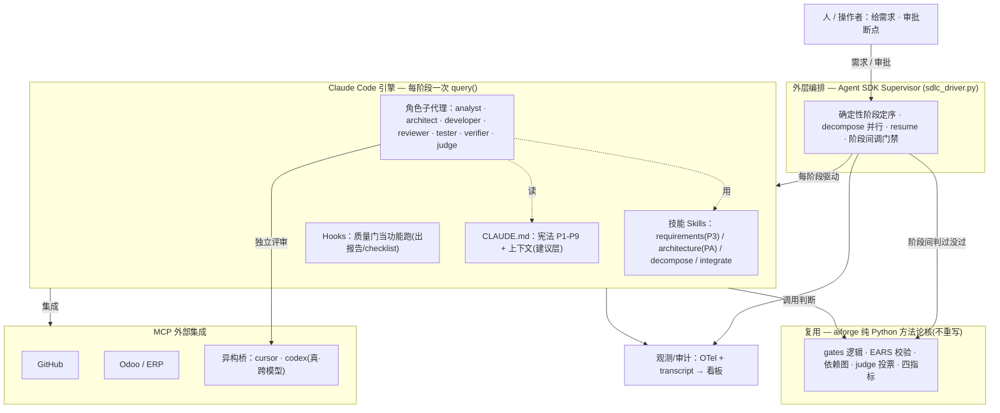
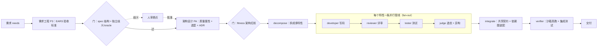
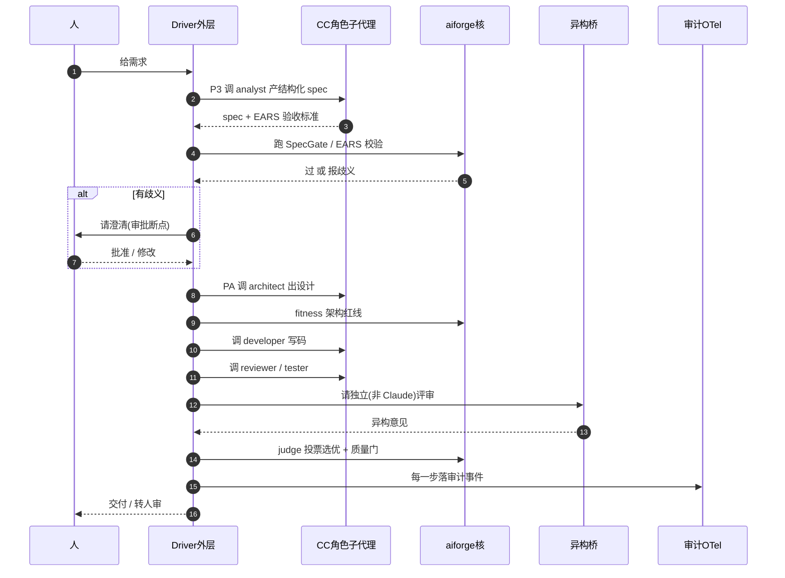

# AISEP × Claude Code — 架构决策文档(ADR + 关键事实速查)

| | |
|---|---|
| **日期** | 2026-06-10 |
| **状态** | 讨论沉淀;功能版优先,强制版后续 |
| **范围** | 把 AISEP/aiforge 重平台到 Claude Code 的架构决策、关键事实、取舍与待办 |
| **关联交付物(同目录)** | 可行性报告 `AISEP移植ClaudeCode作为企业工程harness-可行性与实施设计-完整报告.md`(+`.html`/`.m4a`)、完整实施方案 `AISEP移植ClaudeCode作为企业工程harness-完整实施方案.md`(+`.html`/`.m4a`)、功能版架构图 `AISEP-ClaudeCode功能版架构图.html` |

> 本文是**决策日志**,不是教程。事实条目均标注官方来源;凡**我们自造的简写**(非行业标准词)显式标 ⚠️。

---

## 0. 背景与定位

- **用户决策(已拍板)**:把 AISEP 重平台到 Claude Code。**框架反转**——不是"CC 当 aiforge 的可插拔后端",而是"**CC 当执行引擎,aiforge 的七层方法论当套在 CC 上的企业工程 harness**"。理由:最快、完全借力 CC 的成熟能力。
- **现状**:核心 `src/aiforge/` **当前并不调用 Claude Code**(默认用确定性离线 `MockLLM`,见 `llm.py`);只有调研用的隔离骨架 `backends.py` 真的 shell-out 调 `claude -p` / `cursor-agent` / `codex`。
- **两个版本(本轮厘清)**:
  - **功能版**:抛开 fail-closed 强制约束,只求**功能跑通**。结论=可基本完整实现、且自然、工程量小。本文档主线。
  - **强制版**:在功能版上叠加"AI 也掀不翻"的企业级保证(见可行性报告/实施方案)。需要大量进程外脚手架,是后续。

---

## 1. 关键事实速查(均经官方文档核实)

### 1.1 两种运行模式
| 模式 | 命令 | 含义 | 谁在驱动 |
|---|---|---|---|
| 交互(interactive) | `claude` | 人坐着来回聊;实时审批 | 人 |
| 无头 / print / programmatic | `claude -p`(=`--print`)/ **Agent SDK** | 跑一次、吐结果、退出;给程序/脚本/CI | 程序 |

- **`claude -p` 与 Agent SDK 是同一个引擎**(官方 headless 文档明示)。
- 无头**默认加载** CLAUDE.md / skills / hooks / MCP / 记忆(与交互一致);**除非 `--bare`**(跳过自动发现、只认显式 flag),且官方称 **`--bare` 将成为 `-p` 的默认**。
- 来源:[headless 文档](https://code.claude.com/docs/en/headless)

### 1.2 成本变更(外部约束,务必纳入预算)
- **2026-06-15 起**:`claude -p` / Agent SDK / GitHub Actions / 第三方 SDK 调用**不再吃订阅额度**,改走**单独月度额度**:Pro $20 / Max 5x $100 / Max 20x $200,**按完整 API 价计费、不滚存**,用完即停或开超额按 API 价。
- **交互模式不受影响**(仍走订阅)。**cursor/codex 是各自厂商条款**,不归此变更管。
- 影响:**"借 CC 几乎免费"假设在 Claude 侧失效**;自动化 harness(全程无头/SDK)= 全部计入 Agent SDK 额度。
- 来源:[headless 文档提示框](https://code.claude.com/docs/en/headless) · [Agent SDK 计费支持页](https://support.claude.com/en/articles/15036540-use-the-claude-agent-sdk-with-your-claude-plan)

### 1.3 配置 vs 指令:强制 vs 建议(核心心智)
- **`settings.json`(配置摞)= 客户端强制执行**;**`CLAUDE.md`(指令摞)= 建议,模型可无视**。官方原话:"Settings rules are enforced by the client regardless of what Claude decides. CLAUDE.md instructions shape behavior but are not a hard enforcement layer."
- **要硬拦** → 用 hook / `permissions.deny` / `sandbox`;**要引导** → 用 CLAUDE.md。
- 来源:[settings 文档](https://code.claude.com/docs/en/settings) · [memory 文档](https://code.claude.com/docs/en/memory)

### 1.4 优先级与层级
- **settings 优先级(覆盖)**:受管 Managed > 命令行 > 本地 Local > 项目 Project > 用户 User。**hooks 与权限规则特殊:跨层合并(叠加)而非覆盖**。
- **CLAUDE.md(拼接,非覆盖)**:受管 → 用户 → 项目 → 本地 → 子目录(按需);全部叠进上下文,越靠近 cwd 越靠后读。
- 来源:同上两页。

### 1.5 受管/企业设置(强制版前置)
- 文件:**`/Library/Application Support/ClaudeCode/managed-settings.json`**(macOS),格式同 settings.json;可用 `managed-settings.d/*.json` 分片(字母序合并)。
- **前置**:写该路径需 **root/sudo**。**"用户删不掉"的真锁需 MDM**(Jamf/Kandji/Intune,经 `com.anthropic.claudecode` plist 下发);纯 root 文件**有 sudo 的用户仍能删**=best-effort。
- 关键锁定键:`allowManagedPermissionRulesOnly`、`allowManagedHooksOnly`、`allowManagedMcpServersOnly`、`strictPluginOnlyCustomization`、(禁 bypass 模式相关键名以 settings 文档为准)。
- 来源:[settings 文档](https://code.claude.com/docs/en/settings) · [官方 MDM 模板](https://github.com/anthropics/claude-code/tree/main/examples/mdm)

### 1.6 子代理的两种调法(本轮厘清,影响确定性与计费)
| | A · 每阶段一次独立 `query()` | B · 会话内原生子代理(Task 工具) |
|---|---|---|
| 是否单独 `claude -p` | 是,一个角色 = 一次无头调用 | **否**,"subagents work within a single session"(会话内,不另起进程) |
| 谁决定派活 | **你的代码**(确定性) | **模型自己**(不确定) |
| 限工具/路由模型 | 能(每次 query 带 allowedTools/model) | 能(可路由到 Haiku 省钱) |
| 用途 | **确定性 supervisor 主干** | 阶段**内部**子任务 |
- **两者都走无头(Agent SDK)** → 6-15 后都计入 Agent SDK 额度。
- 来源:[subagents 文档](https://code.claude.com/docs/en/sub-agents)

### 1.7 审计(OTel)与两个自造词
- `env` 里设 `CLAUDE_CODE_ENABLE_TELEMETRY=1` + `OTEL_*`(exporter/endpoint/protocol/headers)即开 **OpenTelemetry**:把 metrics(成本/token/权限决策计数…)+ events(`tool_result`/`api_request`…)发到**外部 collector**。**默认只记元数据,不记内容**(prompt/工具参数/文件内容需 `OTEL_LOG_USER_PROMPTS`/`OTEL_LOG_TOOL_DETAILS`/`OTEL_LOG_TOOL_CONTENT` 显式开,且截断 60KB)。
- ⚠️ **"事件级黄"**(自造词)= 在"记了哪些动作/决策"这一层,OTel 能达到红绿灯里的"黄"(抗篡改但不完整);要到"具体改了什么"(内容级)就不够。
- ⚠️ **"外部 HMAC sink"**(自造词,各块为标准术语)= 一本"改不了(HMAC 签名)、删中间会露(哈希链)、撕尾会露(外部 anchor)、AI 够不着(进程外)"的审计账本。补 OTel 顶不住的"内容级+防篡改"那半。
- 来源:[monitoring/OTel 文档](https://code.claude.com/docs/en/monitoring-usage)

### 1.8 当前会话模型
- **Claude Opus 4.8**(`claude-opus-4-8`),交互模式 → 走订阅。

---

## 2. 架构决策记录(ADR)

> 状态图例:✅ 已采纳(用户) · 🔷 建议 · 📌 记录(外部约束/前置) · ❓ 待决

### ADR-001 ✅ 平台选型:CC 当引擎,aiforge 方法论当 harness
- **决策**:Claude Code 提供引擎(模型驱动 loop / 工具 / 子代理 / 技能 / hooks / MCP / Agent SDK);aiforge 七层方法论叠在其上。
- **理由**:最快、复用 CC 成熟能力,不重建引擎。
- **取舍**:放弃离线/零依赖/引擎层厂商中立(P9);受监管/气隙线如需,另留自托管引擎(`runtime/openhands.py` seam)。

### ADR-002 🔷 两版本并存,功能版优先
- **决策**:先落"功能版"(抛开 fail-closed 强制);"强制版"(企业级 fail-closed)为后续叠加。
- **理由**:难点从来是"强制",不是"功能";先把功能跑通、再按需加保证。
- **取舍**:功能版复刻**行为/功能**,不复刻**防 AI 掀翻的保证**。

### ADR-003 🔷 编排主干:Agent SDK 外层 supervisor + 每阶段独立无头 query()
- **决策**:`sdlc_driver.py`(Agent SDK)做确定性外层——按阶段定序、decompose 并行、resume;**每个角色/阶段 = 一次独立无头 `query()`(调法 A)**;阶段内部可用原生 Task 子代理(调法 B)。
- **理由**:复刻 `graph.py` 的确定性 index 路由 + 每角色最小工具集 + 阶段间跑门禁;A 由代码定序(确定),B 由模型定序(不确定)。
- **取舍**:全程无头 → 6-15 后计入 Agent SDK 额度(见 ADR-009);CC 会话 append-only,不能真回滚(只能拒绝推进/重跑)。
- **修订(2026-06-11,STEP 0 v2 §5;经对抗证伪裁决)**:
  - 升级阶梯改**四级**:人肉定序 → repo 脚本/CI → 会话内 Workflow 编排 → SDK driver(进程外)。
  - 触发条件改写——**硬触发**(任一命中或 Agent SDK 1.0 发布即重评):需要进程外强制 / 无人值守运行(定时、失败重试与幂等、队列)/ 跨会话权威状态 / 多操作者纪律 / secret 隔离 / 成本预算熔断 / 可重放执行;**软信号**(预警,不单独触发):decompose 经常拆出 ≥3 特性并行。
  - **driver 是有条件推迟,不是取消**:会话内编排是"被约束方自己执行的约束",崩溃恢复是对转录的 best-effort 再解读而非幂等重放,无人值守按定义在会话外——范畴差异,功能补不上(证伪记录见 v2 §9)。
  - 推迟的经济前提(有头≈零边际成本)在计费节点(6-15 等)后**须复核**;升级到无头前必须有 M4 成本实数(经济性判断用,**不得**压过安全/治理类硬触发)。

### ADR-004 🔷 复用 aiforge 纯 Python 方法论核(不重写)
- **决策**:`gates` 逻辑 / EARS 校验 / 依赖图 / judge 投票 / 四指标等**原样复用**为库,被 skills/hooks/driver 调用。
- **理由**:已 CC-free、纯 stdlib、已被测试覆盖;重写=造假负担 + 迁移中途破测试。
- **取舍**:用 import-linter 契约守住"核不依赖 CC"边界(强制版细化)。

### ADR-005 🔷 组件映射
- **决策**:角色 agent → `.claude/agents/*.md`;SDLC 阶段 → `.claude/skills/`(requirements/architecture/decompose/integrate);质量门 → hooks(**功能版当报告/checklist**,强制版走服务端);外部集成 → MCP;宪法 → CLAUDE.md(**建议层**)。
- **理由**:CC 扩展面与 AISEP 七层近 1:1。
- **取舍**:CLAUDE.md 仅建议;真强制在强制版另做(见可行性报告 §3)。

### ADR-006 🔷 异构跨模型验证 = shell-out cursor/codex(唯一非原生)
- **决策**:judge 阶段出 CC 进程调 `cursor-agent`(GPT-5.5)/`codex`;**缺真厂商 → fail-closed 转人审,绝不静默退回 Claude-审-Claude**。
- **理由**:CC 子代理全 Claude = 共享盲区循环自证;真异构必须不同模型。
- **取舍**:这是全图唯一非原生处;runner+keys 在强制版须移出模型可写路径。

### ADR-007 🔷 审计 = OTel 事件级 + 可选外部 HMAC sink 内容级
- **决策**:受管 env 强制开 OTel 到外部 collector(事件级,零自研);高保证场景再加外部 HMAC sink(内容级+防篡改)。
- **理由**:OTel 原生、抗篡改、关不掉(受管 env);但对 Bash 内部盲、默认不记内容、非防篡改账本。
- **取舍**:见 1.7 的两层与限制。

### ADR-008 📌 配置强制 = managed-settings.json(文件需 root;真锁需 MDM)
- **决策(强制版前置)**:用受管设置锁 bypass/权限/hooks;单机为 best-effort(root 文件),企业强保证须 enroll MDM。
- **取舍**:无 MDM 时 sudo 用户可删 → 强制版"单一裁决门"须在真机证明锁住才继续。

### ADR-009 📌 成本模型(外部约束)
- **记录**:6-15 起无头/Agent SDK 走单独额度($20/$100/$200,API 价,不滚存);交互走订阅;cursor/codex 另算。
- **影响**:自动化 harness 全程无头 = 全计入 Agent SDK 额度;预算与"白嫖"假设须重算。
- **修订(2026-06-11,Fable 5 价签;来源:官方 API 参考,验证日期 2026-06-11)**:Fable 5 API 价 **$10/$50 每 MTok = Opus 4.8($5/$25)的 2 倍** → 无头额度燃烧速度翻倍,**有头先行的经济理由加码**。控本手段备查:effort 档(low~max)、task budgets(beta)、Batch 五折、cache 读 ~0.1x。**第三方流传的 credit 细节(具体额度拆分/滚存/订阅窗口日期)未经官方核验,不入硬阈值,预算承诺前必须官方二次确认**(契约 10 第 4 条登记处)。

### ADR-010 🔷 模型策略:重角色 Opus,廉价/并行子任务 Haiku
- **决策**:architect/developer/judge 等用强模型(如 Opus);搜索/格式化/并行子任务路由到 Haiku 控本。
- **理由**:官方子代理支持按角色路由更便宜模型。
- **修订(2026-06-11)**:阶梯更新为 **Fable 5(最强,长程 agentic 主打)> Opus 4.8(半价)> Haiku(廉价 fan-out)**;同模型内**先调 effort 档再降模型**(粒度更细)。但 judge/architect 等角色最终用哪一档**由 M4 任务集实测决定**,不按"越强越好"线性排——更强模型也可能更会合理化错误。角色级精调矩阵显式推迟(v2 §2.2)。API 硬注意见契约 10 登记处(Fable 5 仅 adaptive thinking 等)。

### ADR-011 ✅ STEP 0 有头先行(本方案,2026-06-11)
- **决策**:supervisor 由人担任(有头交互模式);功能版组件(M1 薄 CLI / M2 agents+skills / M3 会话护栏 / M4 进程外强制+成本测量)全部落地;driver 按 ADR-003 修订后的四级阶梯与触发条件升级。
- **状态存储** = `specs/<id>/` 文件契约 + gate receipt 链(契约 06/08),将来 driver 原样继承,无沉没成本。
- **完整方案**:`AISEP-ClaudeCode有头先行实施方案-v2.md`(v1 已被取代,保留为历史)。

### ADR-012 📌 driver 防御占位(随 driver 生效;**随推迟保留,不得随"取消"废除**)
- **决策**:将来任何 driver 不依赖 `-p` 自动发现(防 `--bare` 成为默认后语义翻转)——所有加载项(CLAUDE.md/skills/hooks/MCP)显式传参 + 钉死 CLI/SDK 版本。
- **连带**:会话内编排骑在自动更新的客户端上、无法钉版本——这正是它不能当权威层的理由之一(契约 01)。

### ADR-013 ✅ STEP 0 就地实施(不新开 repo)+ 基线 tag(2026-06-11)
- **决策**:STEP 0 在本 repo 就地清理后实施,不 clone/不新建仓;基线 = tag `archive/pre-harness`(D0 合并 `chore/health-improvements` 后打)。需要"新项目门面"时把本 repo push 到新建 GitHub 远端。
- **依据**:经对抗证伪(可执行探针)——clone 的收益全部是现 repo 已有性质;新 repo 三类真实成本(无 origin 远端冻结不可强制 / `~/.claude/projects` 记忆按绝对路径键控会孤儿化 / `.cursor/`与调研文件夹等非 git 资产不随 clone)。完整留痕见 `AISEP-ClaudeCode有头先行实施方案-v2.md` §9。
- **就地清理记录**:① 工作区 3 修改(PEP 562 破循环)入库;② `.gitignore` 改为只忽略 `.claude/settings.local.json`;③ 0 号地雷双层排查(项目级落 `defaultMode=acceptEdits` 覆盖;用户级 `bypassPermissions` 待用户裁决);④ `judge.py` trust_llm 翻转默认不可信+回归测试;⑤ 入库/归档分界:决策上下文(本文档、实施方案 v1/v2、harness 可行性报告与完整实施方案 md、功能版架构图 html、健康度报告 md)入库;衍生渲染(html 重复版)/音频(m4a)/项目健康度 skill 调研三件套 → `../AISEP6-6-archive/`;`.cursor/`(本机工具状态)加 gitignore。
- **验收命令**:`make test`(34 绿)+ `make arch`(2 契约 kept)。
- **唯一例外场景(备查)**:将来把 harness 抽成给其他项目用的模板/发行物时才新开 repo,性质是"抽取发布"非"迁移"。

### ADR-014 ✅ 权威层级声明(2026-06-11;全文见 `specs/contracts/01-authority-layers.md`)
- **决策**:唯一强制层 = GitHub CI + branch protection + CODEOWNERS;pre-commit = 反馈层(可旁路,明文承认);hooks/`permissions.deny` = 会话护栏;CLAUDE.md = 建议层;**会话内的一切编排(Workflow / Agent 工具 / 长程会话)永远不是强制**,任何 ADR 不得以会话内构件作为权威层论据。
- **理由**:会话内约束是"被约束方自己执行的约束";纯 hook 防护已被实测定性为剧场(用户真 hook 全旁路)。
- **修订注(2026-06-11,用户裁决的已知偏差)**:branch protection **不开** "Do not allow bypassing"(admin 可 bypass)——单人仓库日常代价考量。后果:强制层对 repo admin(用户本人)不生效,只对其余主体生效;探针验收标准同步弱化为"merge 被 blocked(非 admin 视角)"。强制版或多操作者时(ADR-003 硬触发"多操作者纪律")须重开此项。仓库形态 = public(branch protection 免费生效);用户级 bypassPermissions 保持现状(本仓库项目级已覆盖,真锁为强制版 managed-settings 事项,ADR-008)。

### 待决 ❓
- ~~编排落点:纯 Agent SDK driver vs lead-skill 驱动~~ → **已裁决**(ADR-003 修订 + ADR-011):四级阶梯,STEP 0 = 人肉定序,Workflow 为会话内观察项(不承重)。
- decompose 并行的具体实现 → 选项收敛:Agent 工具(per-agent worktree 隔离 + 后台运行)为最自然实现;待第一轮试运行后定。
- 看板复用骨架 `console.py` 自省式方案还是新建(开工前不裁决,v2 §2.2 推迟清单)。
- 强制版是否、何时启动(取决于是否要对外/受监管交付)。
- (新)敏感库是否默认路由 Opus 4.8 而非 Fable 5(数据保留政策差异待核验)——一行待决,STEP 0 不建设。

---

## 3. 目标架构(功能版)·三视角

> 渲染版见 `AISEP-ClaudeCode功能版架构图.html`。下为源(多数 Markdown 查看器/GitHub 可直接渲染)。

### 图 1 · 分层总览

### 图 2 · SDLC 管线流程

### 图 3 · 调用时序

### 组件映射表
| AISEP 能力 | CC 机制 | 原生? |
|---|---|---|
| 宪法 P1-P9 | CLAUDE.md(分层)+ output style | ✅ 建议层 |
| 规格驱动 specify→plan→tasks | 每阶段一个 skill | ✅ |
| 角色 agent | `.claude/agents/*.md` 子代理 | ✅ 字面对应 |
| Supervisor 确定性编排 | Agent SDK 外层 driver(调法 A) | ✅ |
| 上下文工程 | CLAUDE.md 层级 + skills + auto memory | ✅ 近 1:1 |
| Runtime 沙箱 | Bash 工具 + OS 沙箱 / MCP 驱动 | ✅ |
| 质量门 / judge / 四指标 | hooks + judge 子代理 + 复用核 | ✅ 功能层面 |
| 审计 + 看板 | OTel + transcript + 看板 | ✅ |
| P3 / PA / decompose / integrate | skills + 子代理 fan-out + 复用 dep-graph | ✅ |
| **真·跨模型异构** | **shell-out cursor/codex** | ⚠️ 唯一非原生 |

---

## 4. 功能版 vs 强制版(取舍)

| 之前为"强制"要做的 | 功能版 |
|---|---|
| managed-settings 受管锁定 | ❌ 不用 |
| 外部 HMAC sink | ❌ 不用(OTel/transcript 记着看) |
| 进程外 ApprovalAuthority + HMAC 票据 | ❌ 不用(交互里人审) |
| vendor attestation | ❌ 不用 |
| server 端 git/CI 当不可绕 backstop | ❌ 降为普通 CI |
| **子代理 / skills / SDK supervisor / hooks / MCP / 复用核** | ✅ 全留 = 功能版全部 |

> 一句话:**功能版 ≈ 角色子代理 + 阶段 skills + Agent SDK 外层 supervisor + hooks(当功能)+ MCP + 复用 aiforge 核;强制版 = 在此之上叠"AI 也掀不翻"的进程外保证。**

---

## 5. 下一步候选
- 出"功能版实现蓝图":每个角色子代理职责+工具、每个 skill 输入/输出、`sdlc_driver.py` 骨架、哪些直接 import 现有核。
- 或起 STEP 0 原型(从复用核 + 一个角色子代理 + 一个 skill 跑通最小闭环)。
- 强制版:何时启动、是否上 MDM(取决于交付对象)。
