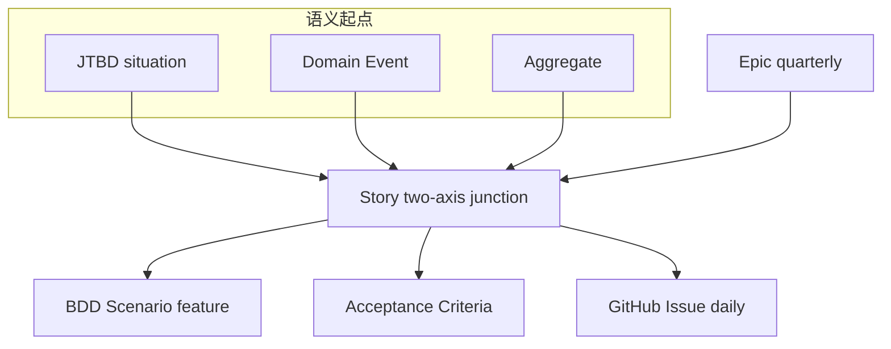
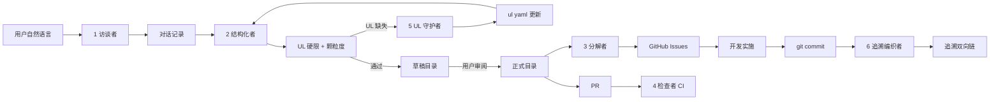

> **来源**:老库 AISEP416/requirements-engineering-methodology.md。本文为方法论/知识沉淀,非当前 harness 现行强制规范(契约 01:诚实标注建议层)。72KB 需求工程方法论(粒度规则/变更管理 R1-R3/6 角色);偏 Odoo/LangGraph,取其粒度与变更管理思想作参考。

# AISEP 需求工程化方法论（M4–M6 基调）

> 本文件是方法论讨论的沉淀，单文件自包含，不是 ADR，不是 policy。
>
> 项目根目录独立文档，不进 MkDocs nav，不被 Fitness Function 扫描，与 [ai-sdlc-conversation.md](ai-sdlc-conversation.md) 同风格作为设计留档。
>
> 落笔日期：2026-04-21

---

## 第 0 节 · 阅读指引

### 对谁写

- **首要读者**：接手 M4–M6 需求工程化实施工作的 AI 或工程师
- **次要读者**：未来做 v14 → v18 迁移、建追溯图、写架构白皮书时需要回溯"M4–M6 基调从哪来"的人
- **不是写给**：项目外部读者（白皮书另写）、产品经理 / 业务方（对外叙事另写）

### 为什么单文件而不进 ADR 或 policies

- **ADR 是封板决策**：[policies/adr-lifecycle.md](policies/adr-lifecycle.md) 规定 ADR Accepted 后 Context / Decision / Alternatives / Consequences 四章封板。本文档还在"方法论探索讨论"阶段，很多决策颗粒度比 ADR 细（比如"Story 3–7 天"），不适合一次性封板
- **policy 是执行级规范**：[policies/ai-workflow.md](policies/ai-workflow.md) 这种 policy 面向日常操作。本文档是方法论层面的背景知识，比 policy 更上一层
- **ADR / policy 会按需从本文档摘取**：当实施 PR 需要把"需求工程化主题"升级为 ADR 或把"UL 硬限规则"升级为 policy 时，再摘取对应章节做封板

### 不在本文档射程内的事

- ROADMAP 具体改写（M4 / M5 / M6 各月的 PR 排期）
- VISION 70% 目标的修订（留给独立 ADR）
- Schema 具体字段定义（留给实施 PR，Yamale 表达式级别）
- AI 角色的具体 prompt 模板（留给实施 PR）
- Fitness Function 的具体正则表达式和判定代码（留给实施 PR）
- 任何代码实现

### 怎么读本文档

如果时间紧张，**只读第 2 节**（速查表）+ **第 13 节**（交接清单）即可动手。

如果要深入理解，从第 1 节开始顺着往下读。第 3 节（方法论历史脉络）可以跳过，不影响实施；但跳过后容易在别的选择出现时不知所措。

---

## 第 1 节 · 背景

### 1.1 项目当前位置

AISEP 的 M1–M3 地基阶段接近收尾（8 项里程碑中 5 项完成 + 3 项进行中，实质完成度约 85%）。本文档写作时（2026-04-21），仓库主分支最近的 commit 是 `095d64d feat(policies): adr-lifecycle.md v1.0`，累计 19 个 PR 全部 merged。

按原 [ROADMAP.md](ROADMAP.md) M4–M6 计划，接下来六个月要并行交付 7 项里程碑：

- 审查 Agent 上线（P3 收尾）
- 需求 Schema v1 落地
- 需求解析 Agent
- 代码生成 Agent
- 测试用例生成 Agent
- PR 追溯链自动校验
- 顾问产能基线测量

### 1.2 问题识别

经过 5 轮对话讨论，识别出原 M4–M6 计划存在两类问题：

**问题类 A — 容量超载**。按 M1–M3 实测速度（约 1 个月 = 19 PR / 36 commit 全职当量），每个成熟 Agent 的 P1→P3 周期约 3–5 周。M4–M6 原计划 7 项里程碑总工作量约 20 周，实际 12 周可用，超载约 1.7 倍。不是"努力一下就能做完"的级别，是结构性超载。

**问题类 B — 风险排序错位**。4 个独立 Agent 同时开工的计划里，需求解析 Agent 是唯一一个"输出没有 ground truth、最难验证"的 Agent。但原计划把它和其他 Agent 并行做，等于在最不确定的事情上分散投入，无法集中精力把它做好。

### 1.3 方法论转向的核心判断

三条判断支撑把 M4–M6 主题改成"需求工程化"：

1. **需求是软件工程里最不可控、最难工程化的环节**。Fred Brooks 1987 年在《No Silver Bullet: Essence and Accident in Software Engineering》里给出的经典论断："the hardest single part of building a software system is deciding precisely what to build"。40 年过去，这个判断没变。把最难的事留到 4 个 Agent 互相依赖时再做，等于在系统最脆弱的地方加压力

2. **需求解析 Agent 的输出没有 ground truth**。自然语言 → REQ YAML 的转换正确性无法通过"下游跑通"快速验证（因为下游的代码生成 Agent、测试生成 Agent 本身也没建）。反之，下游 Agent 的输入（REQ YAML）和输出（代码、测试）都高度结构化，可验证性强得多。把"最难验证"的环节放在其他 Agent 之前，等于用最不确定的输入喂下游

3. **AISEP 的核心价值在于"追溯链完整"**（[VISION.md](VISION.md) L35）。追溯链的起点是需求。需求环节的 Schema、颗粒度、人机协作契约不稳，下游所有 Agent 的输出都挂在虚空里。追溯链要有价值，必须从需求环节就开始有标准

### 1.4 本文档与 ADR-0012 的分工

[ADR-0012](architecture/adr/ADR-0012-requirements-engineering-as-m4-m6-theme.md) 已于 **2026-04-21** 经 [PR #23](https://github.com/Albertsun6/AISEP416/pull/23) 从 Proposed 过渡到 **Accepted**（主题方向封板）。

ADR-0012 与本文档的职责切分：

- **ADR-0012 承载**：M4–M6 主题方向 + 决策表 D1–D7 + 任务清单三分类 + Acceptance 语义边界。**只封板决策本身**。
- **本文档承载**：方法论讨论与实施细节（Q1–Q6 速查 / 历史脉络 / 语义结构 / Schema 家族 / 颗粒度规则 / 协作角色 / 端到端演练 / 未决问题）。**不进 ADR 封板是为了方法论本身的可迭代性**（见 §13.9）。

先前讨论过把"方法论讨论 + 决策封板 + 实施指引"混在一份 ADR 里，发现边界不清——既不像 ADR，又不像指南。最终选择剥离：ADR-0012 封决策，本文档做方法论手册。

---

## 第 2 节 · 方法论决策速查表

六项核心决策（代号 Q1–Q6），所有后续章节围绕这六项展开。

### Q1 · 方法论起点 —— 混合

**选择**：JTBD（Jobs-to-be-Done）+ Event Storming 两个语义入口共存，都交汇于 Story。

- JTBD 用于 AISEP 自用的新需求（"当我在做成本回顾时，我想看每周 Langfuse 成本"）
- Event Storming 用于假造 Odoo 场景的需求（"订单金额超额时触发审批"）
- 真实客户需求场景暂不覆盖（M4–M6 不做）

### Q2 · 规划轴 —— Epic + Story 二层

**选择**：

- Epic = 季度级目标，对应约 3–12 个 Story
- Story = 迭代级交付单元，对应 3–7 天工作量
- 不做 Task 独立制品层；Task 用 GitHub Issues 顶替，每个 Issue 带 Story-ID 标签

理由：单人 + AI 协作场景下 Task 的主要用途（调度协同）几乎消失，GitHub Issues 已经能承担"天级工作项"的记账职责。

### Q3 · BDD 地位 —— C.2 推荐制品

**选择**：

- 关键路径场景**必须**用 BDD Gherkin `.feature` 格式
- 边界 / 异常场景**可选** BDD 或自然语言 AC，由场景复杂度决定
- BDD 文件不在 Story YAML 之外做额外抽象

理由：BDD 一等制品（C.1）对当前 Gherkin 熟练度要求偏高；BDD 完全可选（C.3）又丢失"需求=测试"的核心价值。C.2 是可演进的中间形态，运行一段时间后可以升级到 C.1 或回退到 C.3。

### Q4 · 颗粒度

**选择**（每条都能静态校验）：

- Story 时间维度 **3–7 天**（中位 5 天）可完成
- Story 验收维度 **1–5 个 Scenario** 完整覆盖
- Story 语义维度 **单一 Bounded Context**
- Epic 规模 **3–12 个 Story**
- Epic 允许跨 BC 但**不超 3 个 BC**

违规示例：
- 太粗："做整个审查 Agent" —— 这是 Epic 甚至更大单位
- 太细："加一个 credit_limit 字段" —— 这是 Task
- 跨 BC："销售订单审批并自动生成收款单" —— 跨 sale + account 两个 BC，必须拆

### Q5 · UL 强制 —— 硬限

**选择**：

- Story、Scenario、Epic、Event、Aggregate 等制品的标题 / description / label 字段中出现的**领域名词**，必须存在于 [ubiquitous-language.yaml](ubiquitous-language.yaml)（目前 75 个术语）
- 检测到缺失时按数量分档：
  - 0 缺失 → 通过
  - 1–2 缺失 → 先扩 UL（UL 守护者协助）再保存制品
  - 3 缺失 → 阻断，提示"需求概念范围已偏离现有限界上下文，请重新审视"
- 扩 UL 时每条新术语必填 5 字段：`id / en / zh / definition / bounded_context / examples`

### Q6 · 变更管理 —— 三级规则

**选择**：

- **R1 版本号 bump**（semver 语义化版本）：同 Story 内升级 —— PATCH = 措辞 / MINOR = 新增 AC 或 Scenario / MAJOR = 改阈值或删 AC
- **R2 supersede 链**：结构性变更起新 Story + 旧 Story 标 superseded；支持一对多（拆）和多对一（合）
- **R3 deprecate**：终态废弃；不删文件，保留追溯
- **影响传播标签** `downstream_invalidation`：每次 bump 或 supersede 必填，取值 `none / metadata_only / tests / code`，让下游 Agent 知道哪些产出失效

---

## 第 3 节 · 方法论历史脉络

这一节给出软件工程史上需求工程方法论的演化线，帮助理解"为什么选混合起点"而不是"只选 JTBD"或"只选 Event Storming"。方法论不是凭空出来的，每个方法论解决的是上一代方法论解决不了的问题。

如果时间紧，本节可跳过，直接看第 4 节语义结构。

### 3.1 1960–1970 年代 · 需求即代码注释

这个时期没有专门的"需求工程"。需求写在代码注释里，或者在纸质备忘录里。Fred Brooks 1975 年《人月神话》观察到"决定造什么是软件工程最难的部分"，但只是指出问题，没给方法。

**对 AISEP 的适用程度**：不适用。

### 3.2 1984 · IEEE 830 SRS

IEEE 830《软件需求规格说明推荐实践》发布。第一次把需求变成**结构化文档**：章节（引言 / 范围 / 功能需求 / 非功能需求 / 接口 / 数据）+ 编号（SR-001, SR-002…）+ 签字页。

**原始动机**：甲乙方合同纠纷。甲方说"不是这个"，乙方说"合同写了"。SRS 把"我要什么"做成白纸黑字合同。

**解决的问题**：需求与交付对齐的合同基线。

**代价**：写好就不能改；写 SRS 比写代码还慢；需求一变整个 SRS 重写。瀑布开发被放大成极端形态。

**对 AISEP 的适用程度**：**不适用**。AISEP 不是甲乙方场景，不需要合同基线；单人全职 + AI 协作对 SRS 的重量级结构承受不起。

### 3.3 1992–1995 · Use Case / KAOS / i\*

1992 年 Ivar Jacobson 在 OOSE 方法里提出 Use Case：主角 + 主路径 + 扩展路径，把功能串成完整交互。

1993 年 Axel van Lamsweerde 提出 KAOS（Knowledge Acquisition in autOmated Specification）。

1995 年多伦多大学提出 i\* 框架。

**原始动机**：SRS 的功能需求是孤立条目（"系统应能计算税额"），读者无法判断这些功能组合起来是什么样的流程。Use Case 解决交互流的可视化；KAOS / i\* 解决"为什么要造"的目标层缺失问题。

**解决的问题**：从 What 上升到 Why。

**代价**：Use Case 一个系统要画几十个图，重；KAOS / i\* 太形式化，需要学术背景团队才用得起来。

**对 AISEP 的适用程度**：
- Use Case **部分适用**，但会被 BDD 场景覆盖
- KAOS / i\* **部分适用**，JTBD 可以替代其目标层表达且更轻量

### 3.4 1999 · Volere 模板

Suzanne 和 James Robertson 发布《Mastering the Requirements Process》，配套 Volere 22 节模板。一条需求要有 Fit Criterion、Customer Satisfaction、Stakeholder、Supporting Materials 等 22 个字段。

**原始动机**：SRS 粒度粗，经常漏东西。Volere 用模板强制完整性。

**解决的问题**：需求完整性。

**代价**：填 Volere 表格比思考需求本身还耗时。

**对 AISEP 的适用程度**：**不适用**。22 字段对单人 + AI 协作过重。

### 3.5 1998–2004 · User Story + 3C

1998 年 Kent Beck 在《XP Explained》中提出 User Story。2004 年 Mike Cohn 出版《User Stories Applied》系统化"As a / I want / So that"格式。同年 Ron Jeffries 提出 3C 模型：Card（卡片只写一行）+ Conversation（真正的需求是口头对齐）+ Confirmation（验收标准）。

**原始动机**：SRS 和 Volere 把需求当成要冻结的合同，但现实是需求一直在变。User Story 刻意写得极短、极模糊，承认它**不是规格，是一次对话的占位符**。

**解决的问题**：敏捷开发下的需求沟通。

**代价**：经常被误用 —— 很多团队把 User Story 当成完整规格，写完就开始做，跳过对话环节，导致"Story 模糊 + 验收不清"。

**对 AISEP 的适用程度**：**部分适用**。Story 作为"工作单元的标识"有用，但必须配合 BDD 场景 + AC，不能只有一张卡片就当规格。

### 3.6 2006 · BDD / Gherkin

Dan North 2006 年正式化 BDD（Behavior-Driven Development），给出 Given-When-Then 的 Gherkin 语法。

**原始动机**：User Story + 对话的问题是"对话不留痕"，团队换人就丢了。BDD 用 Given-When-Then 把对话的结论变成**既是需求又是自动化测试**的双用制品。

**解决的问题**：需求与测试的割裂。

**示例**：

```
Given 员工已提交了一份金额为 8000 元的报销单
When 区域经理在 48 小时内未审批
Then 系统应当自动升级到财务总监审批
And 向财务总监发送邮件提醒
```

这段话既是需求描述，又是可执行的自动化测试脚本。

**代价**：Gherkin 对非功能需求（响应时间 / 并发能力）表达困难；对数据密集型场景（报表 / 聚合）写起来啰嗦。

**对 AISEP 的适用程度**：**强适用**。VISION 的"追溯链完整 + 测试覆盖率"目标和 BDD 天然对齐。本文档 Q3 选择 BDD 为推荐制品（C.2）。

### 3.7 2011 · Specification by Example

Gojko Adzic 2011 年出版《Specification by Example》，把 BDD 扩展为"用可执行例子做活文档"。核心观点：需求不用抽象规则写，用具体例子写 —— 规则从例子里自动涌现。

**原始动机**：文档过时是软件工程永恒的病。用代码里能跑的例子做文档，文档和代码天然同步。

**解决的问题**：文档腐化。

**对 AISEP 的适用程度**：**强适用**。Q3 BDD 推荐制品的深层依据就是 Specification by Example。

### 3.8 2013 · Event Storming

Alberto Brandolini 2013 年提出 Event Storming。不从用户故事开始，而是从**领域事件**开始：在墙上贴橙色便签，写"订单已支付"、"库存已扣减"、"发票已生成"这种过去时事件。事件贴完后反推聚合（aggregate）、命令（command）、策略（policy）、读模型（read model）。

**原始动机**：User Story 和 Use Case 都从"用户视角"出发，丢掉了系统内部状态演化这条线。企业业务系统（ERP、订单系统）的本质是状态机，不是交互。

**解决的问题**：领域模型发现。

**对 AISEP 的适用程度**：**强适用**。Odoo 本质是状态机（订单状态 / 审批状态 / 库存状态），且 [VISION.md](VISION.md) L17 已经把 DDD 列入方法栈。本文档 Q1 选择 Event Storming 作为 Odoo 场景的语义起点。

### 3.9 2016 · Jobs-to-be-Done

Clayton Christensen 2016 年《Competing Against Luck》把 JTBD 从学术推广到产品圈。核心观点：用户不是"想要一个功能"，而是**雇佣产品来完成某个任务**。需求的起点是"用户在什么情境下，想完成什么任务，以达成什么结果"。

**格式对比**：

- User Story：`As a <role>, I want <feature>, so that <benefit>`（角色 + 功能 + 好处）
- JTBD：`When <situation>, I want to <motivation>, so I can <expected outcome>`（情境 + 动机 + 结果）

差别看起来小，实际很大。User Story 隐含"有个角色，这个角色要个功能"，容易滑向"角色驱动的功能清单"。JTBD 追问"这个角色在什么情境下为什么需要完成某件事"，把功能放到"实现任务的手段"这个相对位置。

**对 AISEP 的适用程度**：**强适用**。本文档 Q1 选择 JTBD 作为 AISEP 自用场景的语义起点，特别是"AISEP 维护者"这个角色（CEO + 架构师 + 开发三位一体）的需求表达。

### 3.10 2020s · LLM 辅助需求工程

这是个方法论空白期。没有广泛被采纳的成熟框架。大家都在试：

- 用 ChatGPT 把会议纪要转成 User Story
- 用 Copilot 从代码反推 Spec
- 用 Cursor 在写代码时让 AI 同步更新需求文档

但**没有一个方法论级别的框架**告诉你"AI 应该在需求流程的哪个位置介入、输入输出是什么、如何衡量质量"。

**对 AISEP 的适用程度**：**AISEP 要做的就是填这个空白**。本文档的 6 AI 协作角色（第 8 节）+ 颗粒度规则（第 6 节）+ UL 硬限（第 7 节）+ 变更管理（第 9 节）是对"LLM 辅助 RE 怎么工程化"的一次具体尝试。

### 3.11 方法论选择的收敛逻辑

AISEP 最终选用的是 **JTBD + Event Storming + BDD 三者组合**，不是单选任何一个。

- JTBD 提供情境层（Why 层）
- Event Storming 提供领域层（What 层）
- BDD 提供验证层（How-verified 层）

三者交汇于 Story，由 Story 统一下游（Epic / GitHub Issues / Code）。

没选 User Story 做主力是因为它容易滑向"角色驱动功能清单"；没选 Volere 是因为太重；没选 KAOS / i\* 是因为太学术。

---

## 第 4 节 · 两条起点共存的语义结构

### 4.1 结构总览



### 4.2 各节点职责

- **JTBD situation**：自用场景的情境起点。一份 JTBD 可被多份 Story 引用
- **Domain Event + Aggregate**：Odoo 场景的领域起点。一个事件或聚合可被多份 Story 引用
- **Story**：两轴交汇点。每个 Story 必填 `semantic_parent_type` 字段标记走的是 JTBD 还是 Event Storming；对应字段 `parent_jtbd` 或 `domain_events + aggregates` 由 parent_type 决定必填关系
- **BDD Scenario**：Gherkin `.feature` 格式，承载关键路径验收。每个 Scenario 反向引用所属 Story
- **Acceptance Criteria**：自然语言 AC，承载边界场景。写在 Story YAML 的 `acs` 字段内
- **Epic**：季度级规划单元。每个 Epic 引用 3–12 个 Story
- **GitHub Issue**：天级工作项。每个 Issue 带 Story-ID 标签

### 4.3 关键交互规则

- Story 必须有**恰好一个** `semantic_parent_type`，取值 `jtbd` 或 `event_storming`
- Story 必须有**恰好一个** `bounded_context`（Q4 颗粒度规则）
- Story 必须有**至少一个** Scenario 或 AC（不能两者都空）
- 如果 Story 有关键路径场景，该场景**必须**以 BDD `.feature` 形式存在（Q3 推荐制品规则）
- Epic 必须引用**至少 3、至多 12** 个 Story（Q4 颗粒度规则）

### 4.4 典型输入输出

**JTBD 起点的典型输入**：

```
"当我在做月度成本回顾时，我想按模型查看每周 Langfuse 成本分布，以便规划预算"
```

产出物：

- 1 份 JTBD YAML
- 1 份 Story YAML（semantic_parent_type: jtbd, parent_jtbd: JTBD-XXXX）
- 1–3 份 Scenario `.feature` 文件
- 0–2 条 AC（如果边界场景用自然语言）

**Event Storming 起点的典型输入**：

```
"销售订单金额超过客户信用额度时，应触发区域经理审批"
```

产出物：

- 1–3 份 Event YAML（CreditLimitExceeded / ApprovalRequested / ApprovalApproved）
- 0–2 份 Aggregate YAML（ApprovalRequest 若不存在于现有 aggregate 目录）
- 1 份 Story YAML（semantic_parent_type: event_storming, domain_events: [...], aggregates: [...]）
- 1–5 份 Scenario `.feature`
- 0–3 条 AC

---

## 第 5 节 · Schema 家族设计

本节描述每种制品**承载的语义**和**必要的字段类别**，不定具体 Yamale 表达式。具体 Schema YAML 由实施 PR 在 [requirements/schema/](requirements/schema/) 下扩展。

### 5.1 制品家族概览

六类制品（按引用关系从上游到下游）：

1. **JTBD artifact** —— 情境层（可选起点）
2. **Event artifact** —— 领域事件层（可选起点）
3. **Aggregate artifact** —— 聚合层（事件的归属容器）
4. **Epic artifact** —— 规划层顶层
5. **Story artifact** —— 两轴交汇点（强制）
6. **Scenario artifact** —— 验收层（Gherkin `.feature` 原生格式，不重复造 Schema）

### 5.2 JTBD artifact 必要字段类别

- 身份：id（格式 JTBD-XXXX）、title、version、status
- 三要素：situation、motivation、expected_outcome（JTBD 格式的三句话各一）
- 分类：role（哪个角色的任务，例：AISEP 维护者 / 销售员 / 财务）
- 关联：related_stories（反向引用；由实施 PR 决定是字段还是派生查询）
- 元数据：created_at、updated_at、author、ai_assisted、ai_trace_id

### 5.3 Event artifact 必要字段类别

- 身份：id（格式 EVT-XXXX）、name（过去时，例：CreditLimitExceeded）、version、status
- 语义：description、triggered_by（命令名）、aggregate_ref（所属聚合）
- 下游：consequent_events（列表；如本事件触发哪些后继事件）
- 归属：bounded_context（必须在 [bounded-contexts.yaml](bounded-contexts.yaml) 15 BC 内）
- 元数据：同上

### 5.4 Aggregate artifact 必要字段类别

- 身份：id（格式 AGG-XXXX）、name（聚合根名，例：ApprovalRequest）、version、status
- 语义：root_entity、invariants（不变式列表，每条一句话）、value_objects（可选）
- 归属：bounded_context
- 关联：handled_commands、emitted_events、related_stories
- 元数据：同上

### 5.5 Epic artifact 必要字段类别

- 身份：id（格式 EPIC-XXXX）、title、version、status
- 语义：description、quarter（M4 / M5 / M6 / M7–M9 / …）
- 归属：bounded_contexts（列表，≤ 3 个）、product_pillar（可选）
- 规划：stories（3–12 个 Story ID）、estimated_total_days
- 元数据：同上

### 5.6 Story artifact 必要字段类别

- 身份：id（格式 STORY-XXXX）、title、version、status
- 语义起点：semantic_parent_type（enum: jtbd / event_storming）
- 条件必填：parent_jtbd（当 type=jtbd 时）/ domain_events + aggregates（当 type=event_storming 时）
- 归属：bounded_context（单一）、parent_epic
- **战略锚（稳定语义 ID）**：`strategic_ref`（字符串，引用 [VISION.md](VISION.md) 的稳定语义 ID；格式为 `VISION:GOAL-XXX` 或 `VISION:SUCCESS-XXX`，示例 `"VISION:GOAL-001"`（= 70% AI 主导）/ `"VISION:SUCCESS-001"`（= Odoo v14→v18 升级按期交付）。编号由 [VISION.md](VISION.md) 维护，见其"目标"段的 `GOAL-XXX` 列表与"成功标志"段的 `SUCCESS-XXX` 表）
  - **`[已废弃]`** ~~旧自由文本格式如 `"VISION 70% AI 主导率"` / `"VISION v14→v18 升级按期交付"`~~（自 ADR-0013 Accepted @ 2026-04-25 起废弃，不接受新增自由文本 `strategic_ref`）。当前 `requirements/stories/*.yaml` 尚无实例，无需批量迁移脚本；若未来发现遗留实例，按本 §5.6 规则人工映射到语义 ID
  - 不引入 Layer 0–3 强引用对象结构（`contributes_to_okr` / `supports_capability` / `primary_stakeholder` 等多字段对象**不在本方法论 scope 内**，参见 §14 OQ9）
  - 本字段当前**不强制 Fitness Function 校验**（格式正确性待 ADR-0013 OQ-D 契约 2 处理）；M7+ Layer 0–3 建模时再决定是否升级为强校验
- 验收：scenarios（1–5 个 .feature 路径）、acs（可选自然语言列表）
- 规划：issues（反向引用 GitHub Issue 编号）、size_hint（small / medium / large）
- 变更：change_log（append-only，每次 bump 追加）、superseded_by、parent_story
- 元数据：同上

### 5.7 Scenario artifact

**使用 Gherkin `.feature` 原生格式**，不再造 YAML Schema。示例：

```gherkin
Feature: 销售订单信用额度审批
  在 sale BC 内，覆盖 STORY-0045 的关键路径

  Background:
    Given 客户 "ACME 公司" 的信用额度为 50000 元
    And 当前未结算金额为 45000 元

  Scenario: 超额订单触发审批
    When 销售员录入金额为 10000 元的销售订单
    Then 订单状态应为"待区域经理审批"
    And 系统应触发领域事件 CreditLimitExceeded
```

元数据（Story 关联、创建者、AI trace 等）放 `.feature` 文件头部的注释块：

```gherkin
# Story: STORY-0045
# Version: 1.0.0
# AI-Trace: langfuse://trace/abc123
# Author: yongqian
# Created: 2026-05-01
```

由实施 PR 决定注释块的解析约定。

### 5.8 Schema 目录结构建议（方法论层建议，实施 PR 可微调）

```
requirements/
├── jtbd/
│   └── JTBD-0001-xxx.yaml
├── events/
│   └── EVT-0001-xxx.yaml
├── aggregates/
│   └── AGG-0001-xxx.yaml
├── epics/
│   └── EPIC-0001-xxx.yaml
├── stories/
│   └── STORY-0001-xxx.yaml
├── scenarios/
│   └── credit-approval-basic.feature
└── schema/
    ├── jtbd.schema.yaml
    ├── event.schema.yaml
    ├── aggregate.schema.yaml
    ├── epic.schema.yaml
    ├── story.schema.yaml
    └── (Scenario 用 Gherkin 原生，无需独立 Schema)
```

现有 [requirements/examples/](requirements/examples/) 里的 REQ-0001 / REQ-0002 两条示例，在实施时按"内容接近 Story 层"迁移到 `stories/` 下。迁移由实施 PR 执行，本文档不动原文件。

---

## 第 6 节 · 颗粒度规则

### 6.1 量化规则总表

用列表呈现（不用 Markdown 表格，避免在某些渲染器下错位）：

**Story 颗粒度**：

- 时间维度：3–7 天全职等当量可完成
- 验收维度：1–5 个 Scenario + 0–3 条 AC
- 语义维度：恰好一个 Bounded Context
- 身份维度：size_hint 字段取 small (3 天) / medium (5 天) / large (7 天)

**Epic 颗粒度**：

- Story 数量：3–12 个
- BC 跨度：1–3 个（超过 3 必须拆）
- 时长估算：estimated_total_days ∈ [15, 90]（即 3 周到 2 个月）

### 6.2 识别违规的三种模式

**模式 A · 太粗**：一个 Story 实际是 Epic 伪装。

识别信号：

- Story 标题过于宽泛（"做审查 Agent" / "加所有审批功能"）
- Scenario 数 > 5
- 描述里出现"全部 / 所有 / 完整 / 整套"这类量词
- 时间估算 > 7 天

处理：结构化者自动建议拆成 Epic + N 个 Story。

**模式 B · 太细**：一个 Story 实际是 Task。

识别信号：

- Story 标题是技术单元（"加 credit_limit 字段" / "改一个方法的参数"）
- 没有验收条件或只有 1 条且过于技术
- 时间估算 < 1 天
- 不映射到用户可感知的能力

处理：结构化者提示"这应该是 GitHub Issue（Task），归属到哪个 Story？"，不创建 Story 文件。

**模式 C · 跨 BC**：一个 Story 涉及两个或更多限界上下文。

识别信号：

- Story 引用的聚合属于不同 BC
- Story 描述中混用两种 BC 的术语
- domain_events 来自多个 BC 的命名空间

处理：强制拆成两个 Story + 一个事件传播（Story A 在 BC-1 触发事件，Story B 在 BC-2 响应事件）。这是 DDD 的正确做法。

### 6.3 Fitness Function 映射

本节列出方法论层面的 FF 命名与职责。具体实现由实施 PR 在 [tools/fitness_functions.py](tools/fitness_functions.py) 中扩展。

- **FF-5 story_scenario_count**：每个 Story 的 `scenarios` 数组长度 ∈ [1, 5]；越界为 `story_too_broad` 或 `story_missing_verification`
- **FF-6 story_single_bc**：Story 的 `bounded_context` 必须为单值且存在于 [bounded-contexts.yaml](bounded-contexts.yaml)；关联多个 BC 为 `story_cross_bc`
- **FF-7 story_size_estimate**：Story 必须有 `size_hint` 字段；`large` 必须附带 split_hint 说明（如果不拆原因）
- **FF-8 epic_story_count**：Epic 引用的 Story 数 ∈ [3, 12]；小于 3 为 `pseudo_epic`，大于 12 为 `overloaded_epic`
- **FF-9 ul_compliance**：见第 7 节
- **FF-10 traceability_backref**：每个 Scenario `.feature` 必须反向引用 Story；每个 Story 必须反向引用 Epic 和 parent（JTBD 或 Event）
- **FF-11 change_log_completeness**：见第 9 节
- **FF-12 supersede_chain_consistency**：见第 9 节

### 6.4 规则对 AI 协作的内嵌

颗粒度规则不只是 CI 门禁，还必须内嵌到 AI 协作角色的主动引导中（第 8 节展开）：

- 结构化者在生成 Story 的第一刻就校验颗粒度，不合规时主动建议拆分
- 分解者生成 GitHub Issue 时，若 Issue 数 > 7，反向提示"Story 可能太大"
- 检查者在 CI 层作为兜底，拦截所有漏网之鱼

三重护栏（事前引导 / 事中反馈 / 事后拦截）才不容易失守。

---

## 第 7 节 · UL 硬限规则

### 7.1 规则本体

**所有需求制品**（JTBD / Event / Aggregate / Epic / Story / Scenario 的标题 / description / label / name 字段）中出现的**领域名词**必须存在于 [ubiquitous-language.yaml](ubiquitous-language.yaml)。

**领域名词定义**：
- 名词（排除通用动词、副词、虚词、数字、标点）
- 去掉停用词（如"的"、"和"、"或"、"等"、"是"、"有"）
- 去掉通用业务词（如"系统"、"模块"、"用户"、"过程"）
- 剩下的名词逐个与 [ubiquitous-language.yaml](ubiquitous-language.yaml) 里的 `id / en / zh / aliases` 字段匹配

### 7.2 检测阈值

按缺失数量分档：

- **0 缺失**：通过
- **1–2 缺失**：警告 + 阻断保存；结构化者触发 UL 守护者流程，引导用户扩 UL；扩完后重新保存
- **3 缺失或更多**：硬阻断；提示"需求概念范围已偏离现有限界上下文，请重新审视是否应该归到新的 BC 或分解为多个需求"；此时不自动扩 UL，要求人工介入重新审视需求

3 这个阈值是初始值，实施后可在 M5 根据实际误判率调整（OQ4）。

### 7.3 扩 UL 的 5 必填字段

新术语加入 [ubiquitous-language.yaml](ubiquitous-language.yaml) 时必须填：

- `id`：UL-XXXX 格式，自增编号
- `en`：英文名（首字母大写，驼峰或下划线）
- `zh`：中文名（标准业务用语）
- `definition`：一句话定义（10–30 字）
- `bounded_context`：归属 BC（在 [bounded-contexts.yaml](bounded-contexts.yaml) 15 个内）
- `examples`：至少 2 个使用示例（短句）

扩 UL 通过独立 PR 合并，PR 走 `architecture/**` 触发的 AI 同行评审流程（见 [policies/ai-review-policy.md](policies/ai-review-policy.md)）。

### 7.4 UL 守护者的职责（详见第 8 节）

- 检测到缺失时提示"已有 X 个相似词，是否是同义词？"避免 UL 词典腐化
- 强制填齐 5 字段
- 生成 UL 扩充 PR 的 description 骨架

### 7.5 为什么选硬限而不是软限

软限（CI 只警告不拦截）看起来温和，但实际上会让 UL 词典快速腐化：

- 不被强制用的词会越来越多
- 新人写需求时不查 UL，因为查了也不强制
- 半年后 UL 变成装饰品，追溯链断裂
- 最终 Agent 生成代码时术语不一致（同一个概念有 5 种叫法）

硬限的代价是写需求慢，但换来的是术语一致性 + 追溯链可用。这个取舍在 AISEP 这种"Agent 消费需求"的场景下必须选硬限。

---

## 第 8 节 · 6 AI 协作角色

### 8.1 角色清单与职责边界

**核心 4 角色 + 扩展 2 角色，共 6 个**。

#### 核心 1 · 访谈者（Interviewer）

**实现形态**：LangGraph 对话服务（沿用 [ADR-0010](architecture/adr/ADR-0010-review-agent-implementation.md) 长驻 Python 进程 + SqliteSaver + FastAPI 运行时模式）。

**职责**：把自然语言需求追问到信息充分。

**关键设计**：第一轮判别需求类型，然后切换到对应剧本。

判别规则：

- 自然语言主语是"我 / 用户"、动词是"想 / 希望 / 需要" → JTBD 剧本
- 自然语言主语是"订单 / 系统 / 状态"、动词是"触发 / 变更 / 响应" → Event Storming 剧本
- 两者特征都有 → JTBD 剧本（从用户视角开始更容易，后面再推导事件）
- 完全识别不出 → 问用户"这个需求更接近 A 我想做某件事 / B 系统某个状态变化？"

**类型无关追问（最小战略锚 · 1 问，先于类型剧本）**：

0. 这个需求对应 [VISION.md](VISION.md) 里的哪条目标或成功标志？答案以 `VISION:GOAL-XXX` 或 `VISION:SUCCESS-XXX` 语义 ID 记入 Story 的 `strategic_ref` 字段（见 §5.6；编号清单见 [VISION.md](VISION.md) 目标段 / 成功标志段）。
   - 1 人组织的最小战略锚：不要求 Layer 0–3 独立 Schema，[VISION.md](VISION.md) 已是 Layer 0 的 single source of truth（与 [ADR-0002](architecture/adr/ADR-0002-git-as-primary-ssot.md) "派生 > 重复"对齐）
   - [VISION.md](VISION.md) 的稳定语义 ID 约定（`GOAL-XXX` / `SUCCESS-XXX`）由 [ADR-0013](architecture/adr/ADR-0013-revise-vision-70-percent-delay-to-24-months.md) Accepted 同步修订 PR γ 引入；本追问的答案应直接是语义 ID 字符串
   - Layer 0–3 正式建模推到 M7+ 真客户进场（参见 §14 OQ9）

**JTBD 剧本追问清单（约 5 问）**：

1. 情境具体到哪些环境变量？
2. 动机背后的深层任务是什么？
3. 期望结果用什么指标衡量？
4. 当前没这个能力时用户怎么做替代方案？
5. 成功的边界在哪里（什么情况下这个需求不适用）？

**Event Storming 剧本追问清单（约 6 问）**：

1. 这个事件由什么命令触发？
2. 触发后还会联动哪些下游事件？
3. 涉及哪些聚合？这些聚合是已有的还是新建的？
4. 聚合的不变式（invariant）是什么？
5. 什么情况下这个事件不发生（负例）？
6. 事件的 payload 包含什么字段？

**对话输出**：完整对话记录保存到 `docs/requirements/inbox/YYYY-MM-DD-topic.md`（具体路径由实施 PR 定），同时写 Langfuse trace 记录每一轮的判别依据和 AI 响应。

#### 核心 2 · 结构化者（Structurer）

**实现形态**：对话 Agent 内部一个子节点（与访谈者同一进程，对话结束后由用户触发 `/structure` 命令进入）。

**职责**：把对话记录转成多种制品 YAML + BDD `.feature` 文件。

**产出矩阵**：

- JTBD 类型需求 → 1 份 JTBD YAML + 1 份 Story YAML + 1–5 份 Scenario `.feature`
- Event Storming 类型需求 → 1–3 份 Event YAML + 0–2 份 Aggregate YAML（只在聚合不存在时新建）+ 1 份 Story YAML + 1–5 份 Scenario

**三层校验**（生成后立即执行，不通过不保存）：

1. **Schema 合规**：字段齐全，类型正确
2. **UL 硬限**：所有领域名词查 UL，按第 7 节阈值分档处理
3. **颗粒度预警**：Scenario 数 > 5 或 Story 跨 BC 时主动建议拆分（不自动拆，等用户确认）

**人审门**：生成的制品先写入草稿目录（例：`docs/requirements/draft/`），用户审阅后执行 `/commit` 才移到正式目录。

#### 核心 3 · 分解者（Decomposer）

**实现形态**：CLI 工具 `aisep req decompose --story STORY-XXXX`（不走对话 Agent，按需调用）。

**职责**：把 Story 拆成 GitHub Issues（对应 Task）+ 反向验证颗粒度。

**流程**：

1. 读 Story YAML 的 `acs` 和 `scenarios`
2. 按 AC 和 Scenario 的语义识别技术单元，生成 GitHub Issue 候选列表
3. **反向颗粒度检查**：
   - Issue 数 ∈ [1, 7] → 合规
   - Issue 数 > 7 → 警告"Story 可能太大"，提示用户选择是否拆 Story
   - Issue 数 = 0 → 错误"Story 无法分解"，要求用户补充 AC 或 Scenario
4. 合规后批量调用 GitHub API 创建 Issue，每个 Issue 带 `Story-XXXX` 标签 + 跳转链接
5. Issue 编号写回 Story YAML 的 `issues` 字段

**依赖**：GitHub Personal Access Token（放在 `.env` 不入 git）或 GitHub App（可选，实施 PR 决定）。

#### 核心 4 · 检查者（Checker）

**实现形态**：纯静态脚本，由 [.github/workflows/validate.yml](.github/workflows/validate.yml) 的新 job 触发。

**职责**：在 PR 合并前拦截不合规的需求制品。

**检查项**（扩展 [tools/fitness_functions.py](tools/fitness_functions.py)）：

- FF-5 story_scenario_count
- FF-6 story_single_bc
- FF-7 story_size_estimate
- FF-8 epic_story_count
- FF-9 ul_compliance
- FF-10 traceability_backref
- FF-11 change_log_completeness
- FF-12 supersede_chain_consistency

**无运行时依赖**：不调 LLM，不需要网络，不需要密钥。纯 Python + YAML + 正则。

#### 扩展 1 · UL 守护者（Glossary Guardian）

**实现形态**：CLI 工具 `aisep ul add --term XXX` 或 `aisep ul add --interactive`。

**职责**：维护 [ubiquitous-language.yaml](ubiquitous-language.yaml)，防止词典腐化。

**触发场景**：

1. 结构化者发现 Story 出现 UL 没有的词（自动触发，非交互式）
2. 用户手工扩 UL（交互式，直接用 CLI）

**守护规则**：

- 近义词检测：查现有 UL 是否有拼写相近或语义相似的词（用 LLM 辅助判断），防止"审批"和"批核"同时存在
- 跨 BC 检测：若新词在多个 BC 下都有对应概念，提示用户指定 BC 语义
- 5 字段强制：不填齐不允许保存
- 生成 UL 扩充 PR 的 description 骨架（含新词上下文、为什么需要、相关 Story）

**独立 PR 流程**：扩 UL 必须独立 PR，不能搭车在 Story PR 里。理由：UL 扩充是全仓范围的事实更新，影响面大于单个 Story。

#### 扩展 2 · 追溯编织者（Trace Weaver）

**实现形态**：git pre-commit hook + CLI 工具 `aisep trace verify`。

**职责**：维护制品之间的双向引用。

**场景**：

- 写 Scenario `.feature` 时，自动在 Story YAML 的 `scenarios` 列表里加入
- 创建 GitHub Issue 时，自动在 Story YAML 的 `issues` 列表里加入
- 改 Story 的 `superseded_by` 字段时，自动去新 Story 的 `parent_story` 字段补反向指
- 删除 Story 文件前，检查是否有悬挂的 Scenario / Issue / 下游 Story，有则拒绝

**无 LLM 依赖**：纯关系遍历。

### 8.2 角色之间的协作流



### 8.3 实施分期

M4–M6 容量约 12 周，6 角色分三期吸收：

**第一期 · M4 月 1–2**（约 5 周）

- 核心 4 角色最小可用版本
- 新 Schema（JTBD / Event / Aggregate / Epic / Story 五种；Scenario 用 Gherkin 原生）
- FF-5 到 FF-10 进 CI

**第二期 · M4 月 3 / M5**（约 6 周）

- UL 守护者（扩展 1）
- 2 个 0→1 试验场景跑通
- FF-11 / FF-12 进 CI

**第三期 · M5–M6**（约 4 周）

- 追溯编织者（扩展 2）
- 审查 Agent P3 收尾（M1–M3 遗留）
- M4–M6 总结 ADR + ROADMAP 改写 PR

三期合计约 15 周，M4–M6 实际 12 周，留 3 周缓冲应对迭代返工。

---

## 第 9 节 · 变更管理规则 R1 / R2 / R3

### 9.1 八种变更场景

**S1 · 拼写 / 措辞调整**：例如"销售订单"改"销售单据"，语义不变。

**S2 · 增加一个场景或 AC**：例如补充"48 小时自动升级"场景。

**S3 · 改验收条件的阈值**：例如"金额 > 50000"改"金额 > 30000"。

**S4 · 改 Story 的 parent_epic 或 bounded_context**：例如 BC 从 sale 改 account。

**S5 · 删除一条 AC 或 Scenario**：例如去掉"财务总监终审"。

**S6 · 把一个 Story 拆成两个**：例如"信用审批 v1"拆成"基础审批 + 多币种审批"。

**S7 · 把两个 Story 合并成一个**：例如"审批逻辑"和"审批升级逻辑"合并。

**S8 · Story 整体废弃**：例如客户业务调整不再需要。

### 9.2 三条抽象规则

#### R1 · 版本号 bump（同 Story 内升级）

适用 S1 / S2 / S3 / S5。语义化版本规则：

- **PATCH**（1.0.0 → 1.0.1）：仅元数据 / 措辞 / 格式（S1）
- **MINOR**（1.0.0 → 1.1.0）：新增 AC / Scenario，旧行为不变（S2）
- **MAJOR**（1.0.0 → 2.0.0）：改阈值 / 删 AC / 改行为（S3 / S5）

每次 bump 在 Story YAML 末尾追加 `change_log` 条目（append-only）：

```yaml
change_log:
  - version: 2.0.0
    date: 2026-06-15
    pr: "#142"
    change_type: behavioral_change
    summary: "超额阈值从 50000 降到 30000"
    downstream_invalidation: [tests, code]
  - version: 1.1.0
    date: 2026-06-01
    pr: "#128"
    change_type: additive
    summary: "增加 48 小时自动升级场景"
    downstream_invalidation: []
```

#### R2 · 起新 Story + supersede（结构性变更）

适用 S4 / S6 / S7。

操作序列：

1. 新 Story 用**新 ID**（不复用老 ID）
2. 老 Story 的 `status = superseded`，`superseded_by` 填新 ID（list 支持一对多拆 / 多对一合）
3. 新 Story 的 `parent_story` 填老 ID 列表（反向双链）
4. 下属 Scenario 和 Issue 按新 Story 归属重新组织
5. 老 Story 文件**保留**（追溯需要），不删
6. change_log 仍追加一条 `change_type: split` 或 `merge` 或 `relocate`

#### R3 · Deprecate（终态废弃）

适用 S8。

操作：

1. `status = deprecated`
2. description 末尾加废弃原因和日期
3. 下属 Scenario `.feature` 标为"弃用"但保留文件
4. 已实现代码由开发侧决定清理时机，不强制

### 9.3 下游失效标签

每次 bump / supersede 必填 `downstream_invalidation` 字段，取值范围：

- `none`：无下游影响（纯拆分 / 纯合并等）
- `metadata_only`：仅元数据改动，下游无实质影响（S1）
- `tests`：测试需要更新（S2 / S3）—— 测试生成 Agent（M10+）需要重跑相关 Scenario
- `code`：代码需要重写（S5 / S4 下 BC 变更 / 涉及聚合变更）—— 代码生成 Agent（M7+）需要重生成相关模块

追溯编织者（扩展角色 2）扫到 `downstream_invalidation: [code]` 时，自动给已合并的相关 PR 打评论"上游 Story 有行为变更，需审查代码是否需要调整"。

### 9.4 Schema 新增字段（方法论层占位）

为支持 R1 / R2 / R3，Story Schema 需新增：

- `parent_story`: list of str（反向指，R2 拆/合用）
- `change_log`: list of ChangeEntry（append-only）
- ChangeEntry 嵌入类型：`version / date / pr / change_type / summary / downstream_invalidation`

现有 [requirements/schema/requirement.schema.yaml](requirements/schema/requirement.schema.yaml) v1 已有 `version / status / superseded_by` 三个字段（L19 / L23 / L82），本次扩展只需补 `parent_story` / `change_log` / `downstream_invalidation`（嵌入）。具体 Yamale 表达式由实施 PR 定。

### 9.5 Fitness Function 映射

- **FF-11 change_log_completeness**：每次 Story YAML 在 PR 里被修改时，必须有对应的 change_log 新条目（git diff 检测）
- **FF-12 supersede_chain_consistency**：status=superseded 的 Story 必须有 superseded_by，且指向的每个新 ID 的文件都必须存在，且新 Story 的 parent_story 必须反向包含老 ID

### 9.6 变更流程的角色分工

- **结构化者**：用户说"改 Story 的阈值"时，判断属于 S3，自动生成新 version 号 + change_log 条目草稿 + 提示 downstream_invalidation 标签
- **检查者**：CI 层跑 FF-11 / FF-12，拦截不完整的变更
- **追溯编织者**：维护 supersede 链双向性；`downstream_invalidation` 含 `code` 时给 PR 打告警评论

---

## 第 10 节 · 完整端到端演练

本节用假造 Odoo 场景"销售订单信用审批"，走 14 天完整工作流。这份演练覆盖第 4–9 节所有方法论点。

### 10.1 14 天工作流


### 10.2 Day 1 · 访谈

用户在终端运行 `aisep req start --topic "销售订单信用审批"`。访谈者对话：

```
Interviewer: 这个需求听起来涉及系统状态变化，我按 Event Storming 方式追问。
             你希望触发哪个领域事件？
User: 订单金额超过客户信用额度时，触发审批流程。
Interviewer: 这个事件叫什么？CreditLimitExceeded？还是 CreditApprovalRequested？
             我在 UL 里没查到相关词条，需要先考虑要不要加。
User: 叫 CreditLimitExceeded，同时产生 ApprovalRequested。
Interviewer: 涉及哪些聚合？SaleOrder 和 Partner？
User: 是，还有 ApprovalRequest 是新聚合。
Interviewer: ApprovalRequest 不在现有 aggregates 目录，属于哪个 BC？
User: sale BC。
Interviewer: 超时未审批会怎样？
User: 48 小时没审批自动升级到财务总监。
Interviewer: 取消订单时审批记录怎么处理？
User: 审批记录保留但标记为 cancelled。
Interviewer: 好的，我收集到了 3 个事件 + 1 个新聚合 + 3 个验收场景。
             输入 /structure 进入结构化阶段。
```

对话记录保存到 `docs/requirements/inbox/2026-05-01-credit-approval.md`，Langfuse trace 记录每轮判别依据。

### 10.3 Day 2 · 结构化

运行 `/structure`。结构化者产出草稿：

```
docs/requirements/draft/
├── events/EVT-0012-credit-limit-exceeded.yaml
├── events/EVT-0013-approval-requested.yaml
├── events/EVT-0014-approval-approved.yaml
├── aggregates/AGG-0007-approval-request.yaml
├── stories/STORY-0045-credit-approval-basic.yaml
└── scenarios/credit-approval-basic.feature
```

三层校验：

- Schema 合规：通过
- 颗粒度：Scenario 数 3，合规（[1,5]）；BC 单一 = sale，合规
- UL 硬限：检测到 3 个缺失 —— `ApprovalRequest` / `CreditLimitExceeded` / `ApprovalRequested`

**3 缺失触发硬阻断**，结构化者输出：

```
UL 硬限失败：需求涉及 3 个现有 UL 里没有的领域名词。
  - ApprovalRequest（候选 BC: sale）
  - CreditLimitExceeded（候选 BC: sale）
  - ApprovalRequested（候选 BC: sale）

建议：
1. 如果这些词确实是 sale BC 的新概念，运行 `aisep ul add` 扩充 UL
2. 如果与现有 UL 词有同义，请替换
3. 如果需求范围实际跨 BC，请重新审视分解

草稿保留在 docs/requirements/draft/，UL 扩完后运行 /structure --reuse 复用。
```

### 10.4 Day 3 · UL 扩充

用户运行 `aisep ul add --term ApprovalRequest`。UL 守护者对话：

```
Guardian: 现有 UL 中相似词：Approval（UL-0042）、Request（UL-0019）。
         ApprovalRequest 是否与它们组合关系？
User: ApprovalRequest 是一次具体的审批请求实例，不是抽象概念。
Guardian: 好。请填 5 字段：
         - en: ApprovalRequest
         - zh: ?
         - definition: ?
         - bounded_context: ?
         - examples: ?
User: zh = 审批请求；definition = 一次请求特定审批人批准某项业务动作的记录；
      BC = sale；examples = 销售订单超额审批、费用报销审批
Guardian: 生成 UL 扩充 PR description 骨架完成。请 git checkout -b ul/add-approval-request
         并 commit 后推送。
```

生成的 [ubiquitous-language.yaml](ubiquitous-language.yaml) diff：

```yaml
+  - id: UL-0076
+    en: ApprovalRequest
+    zh: 审批请求
+    definition: 一次请求特定审批人批准某项业务动作的记录，独立于被审批的业务实体
+    bounded_context: sale
+    examples:
+      - 销售订单超额审批
+      - 费用报销审批
```

同理处理 `CreditLimitExceeded`（UL-0077）和 `ApprovalRequested`（UL-0078）。合并 3 条 UL 扩充 PR。

### 10.5 Day 4 · 重结构化

运行 `aisep req structure --reuse-draft --conversation <id>`。这次 UL 校验通过，所有制品移到正式目录：

```
requirements/
├── events/EVT-0012-credit-limit-exceeded.yaml
├── events/EVT-0013-approval-requested.yaml
├── events/EVT-0014-approval-approved.yaml
├── aggregates/AGG-0007-approval-request.yaml
├── stories/STORY-0045-credit-approval-basic.yaml
└── scenarios/credit-approval-basic.feature
```

STORY-0045 的 YAML：

```yaml
id: STORY-0045
title: 销售订单信用额度审批基础流程
version: 1.0.0
status: accepted
semantic_parent_type: event_storming
domain_events:
  - EVT-0012
  - EVT-0013
  - EVT-0014
aggregates:
  - AGG-0007
bounded_context: sale
parent_epic: EPIC-0003
size_hint: medium
scenarios:
  - scenarios/credit-approval-basic.feature
acs:
  - id: AC-0001
    description: 审批超时 48 小时自动升级到财务总监
    verification_method: automated_test
  - id: AC-0002
    description: 审批日志保留 2 年（合规要求）
    verification_method: manual_review
change_log:
  - version: 1.0.0
    date: 2026-05-04
    pr: "#102"
    change_type: initial
    summary: 初始版本
    downstream_invalidation: [none]
```

### 10.6 Day 5 · 分解

运行 `aisep req decompose --story STORY-0045`。分解者产出 5 个 GitHub Issue 候选：

- TASK-0001：在 SaleOrder 上加 credit_limit 计算字段
- TASK-0002：实现 CreditLimitExceeded 事件触发
- TASK-0003：新建 ApprovalRequest 模型和视图
- TASK-0004：实现 48 小时自动升级定时任务
- TASK-0005：单元测试 + BDD runner 集成

反向颗粒度检查：5 个 Issue 在 [1, 7] 区间内，Story 粒度合规。批量创建 GitHub Issue，每个带 `Story-0045` 标签。Issue 编号写回 Story YAML 的 `issues` 字段：

```yaml
issues:
  - 189
  - 190
  - 191
  - 192
  - 193
```

### 10.7 Day 6–12 · 开发

走正常开发流程：

- 每个 Issue 由人 + AI 辅助（Copilot / Claude Code）实现
- 每个 PR 关联对应的 `Story-0045 / TASK-XXXX`
- PR 触发审查 Agent（已在 M1–M3 上线）评审
- PR 合并后 Issue 自动关闭

### 10.8 Day 13 · 检查（PR 合并前 CI）

PR 合并前 CI 跑 FF-5 到 FF-12：

- FF-5 story_scenario_count：1 个 Scenario ∈ [1,5]，通过
- FF-6 story_single_bc：sale，通过
- FF-7 story_size_estimate：medium，有值，通过
- FF-8 epic_story_count：EPIC-0003 有 5 个 Story ∈ [3,12]，通过
- FF-9 ul_compliance：所有新词已入 UL，通过
- FF-10 traceability_backref：Scenario 引用 Story，Story 引用 Epic，通过
- FF-11 change_log_completeness：初始版本，合规
- FF-12 supersede_chain_consistency：无 supersede，N/A

Story 标记 `implementation_status: done`。

### 10.9 Day 14 · 追溯

追溯编织者在 git commit 后自动跑 `aisep trace verify --story STORY-0045`：

- STORY-0045 → EPIC-0003 双向链完整
- STORY-0045 → scenarios/credit-approval-basic.feature 双向链完整
- STORY-0045 → [EVT-0012, EVT-0013, EVT-0014] 双向链完整
- STORY-0045 → AGG-0007 双向链完整
- STORY-0045 → issues [189..193] 双向链完整

追溯链数据写入 Langfuse trace 的 metadata，等 M10+ 追溯图数据库就位后自动入库。

### 10.10 总结

整个流程 14 天完成一个中等 Story：

- **AI 主导环节**（访谈 / 结构化 / 分解 / 检查 / 追溯）：约 60% 工时
- **人主导环节**（业务判断 / 代码细节 / 验收 / UL 扩充决策）：约 40% 工时

符合本方法论下的调整预期（VISION 70% 目标需修订到 55–60%）。

### 10.11 变更演化史（3 个月）

同一个 Story 在后续 3 个月的典型变更轨迹：

**Day 0（2026-05-04）创建**：

```yaml
version: 1.0.0
status: accepted
change_log:
  - version: 1.0.0
    change_type: initial
    downstream_invalidation: [none]
```

**Day 30（2026-06-03）S2 补场景**：

用户补充"部分审批"场景。

```yaml
version: 1.1.0
scenarios:
  - scenarios/credit-approval-basic.feature
  - scenarios/credit-approval-partial.feature  # 新增
change_log:
  - version: 1.1.0
    date: 2026-06-03
    pr: "#234"
    change_type: additive
    summary: 补充部分审批场景
    downstream_invalidation: [tests]
  - version: 1.0.0
    ...
```

追溯编织者扫到 `[tests]`，给 PR #234 打评论"下游测试需补"。

**Day 60（2026-07-03）S3 改阈值**：

信用额度规则从"超额触发"改成"剩余额度 < 订单金额"。

```yaml
version: 2.0.0  # MAJOR，行为变更
change_log:
  - version: 2.0.0
    date: 2026-07-03
    pr: "#278"
    change_type: behavioral_change
    summary: 触发规则从超额改为剩余额度不足
    downstream_invalidation: [tests, code]
  - version: 1.1.0
    ...
```

追溯编织者扫到 `[tests, code]`，给 PR #189 / PR #190 打评论"上游 Story 有行为变更，需审查代码是否需要调整"。

**Day 90（2026-08-03）S6 拆分**：

业务变复杂，决定拆成"基础审批" + "多币种审批"。

```yaml
# 老 Story STORY-0045
version: 2.0.0
status: superseded
superseded_by: [STORY-0078, STORY-0079]
change_log:
  - version: 2.0.0 (拆分)
    date: 2026-08-03
    pr: "#312"
    change_type: split
    summary: 拆成基础审批 + 多币种审批
    downstream_invalidation: [none]
  - ...（保留历史）
```

```yaml
# 新 Story STORY-0078
id: STORY-0078
version: 1.0.0
status: accepted
title: 销售订单信用审批基础流程（无多币种）
parent_story:
  - STORY-0045
...
```

老 Story 文件保留，status 显示为 superseded。追溯查询"STORY-0045 的任意版本被谁实现"时能完整还原。

---

## 第 11 节 · 与现有制品的关系

### 11.1 与现有 Schema 的关系

- [requirements/schema/requirement.schema.yaml](requirements/schema/requirement.schema.yaml) v1 的字段大部分映射到 Story 层。`acceptance_criteria` 字段扩展支持可选的 scenario 引用；`version / status / superseded_by` 字段保留并扩展
- 扩展由实施 PR 做，**本文档不修改 v1**
- 其他 5 类制品（JTBD / Event / Aggregate / Epic / Scenario）需要新 Schema；Scenario 用 Gherkin 原生不建 Schema

### 11.2 与现有 Bounded Contexts 的关系

- [bounded-contexts.yaml](bounded-contexts.yaml) 15 个 BC 是 Story.bounded_context 字段的**封闭枚举**
- Story 不能使用列表外的 BC 名
- 新增 BC 必须通过独立 PR 走架构评审（[policies/ai-review-policy.md](policies/ai-review-policy.md) 触发路径 `architecture/**`）

### 11.3 与现有 Ubiquitous Language 的关系

- [ubiquitous-language.yaml](ubiquitous-language.yaml) 75 术语从"参考字典"升级为"活跃约束资产"
- UL 硬限规则（第 7 节）使其成为需求写作的强制依赖
- UL 的扩充频率随 M4–M6 试验场景增加预计上升，可能新增 30–50 术语

### 11.4 与现有 Fitness Functions 的关系

- [tools/fitness_functions.py](tools/fitness_functions.py) 现有 FF-1 / FF-2 / FF-3 / FF-4 不改
- 新增 FF-5 到 FF-12 共 8 条，扩展在同一个脚本或拆分独立模块均可（由实施 PR 定）

### 11.5 与 ADR-0009 / ADR-0010 Review Agent 的关系

- 需求 Agent 的 HITL 契约**沿用** [ADR-0009](architecture/adr/ADR-0009-review-agent-workflow-and-hitl-contract.md) 的设计模式（interrupt → 人审 → 恢复）
- 需求 Agent 的运行时形态**沿用** [ADR-0010](architecture/adr/ADR-0010-review-agent-implementation.md) 的长驻 Python 进程 + SqliteSaver + FastAPI 架构
- 需求 Agent 和审查 Agent 共享 `agents/shared/llm.py` 的 LLM 网关（FF-4 约束）

### 11.6 与 ADR-0005 追溯图的关系

- [ADR-0005](architecture/adr/ADR-0005-knowledge-graph-database.md) 选型 Neo4j 做追溯图
- 本方法论的 supersede 链 + parent_story + change_log + downstream_invalidation 在 M10+ 建图时自然成为**边**
- 追溯编织者的本地双向链维护是追溯图建立前的"预备状态"

### 11.7 与 ADR-0011 ARCH_PORTAL 的关系

- [ADR-0011](architecture/adr/ADR-0011-arch-portal-frontend-basis.md) 的 MkDocs 扩展 + 派生脚本形态可复用到"需求制品可视化"
- 需求制品可视化（Story 列表 / Epic 看板 / Scenario 覆盖图）在 M7+ 再论，不占 M4–M6 容量
- D5 射程边界：需求制品可视化不在 ARCH_PORTAL v1 射程内

### 11.8 与 ROADMAP 的关系

- 本文档**不改** [ROADMAP.md](ROADMAP.md)
- ROADMAP 的 M4–M6 / M7–M9 / M10–M12 重写由实施 PR 独立处理
- 重写时参考本文档第 8 节"实施分期"作为 M4–M6 主骨架

---

## 第 12 节 · VISION 70% 目标的承压

### 12.1 承压事实

按本方法论实施后的 AI 主导率估计：

- M4–M6 末：约 40%（需求 Agent 上线，但代码生成 Agent 未建）
- M7–M9 末：约 50%（代码生成 Agent 在 v14→v18 迁移中打磨，但测试生成仍人工）
- M10–M12 末：约 55–60%（追溯图 + 需求 Agent 成熟 + 代码生成 Agent 稳定）
- M13–M18 末：仍约 55–60%（规模化不改变比例结构）

**达不到** [VISION.md](VISION.md) L33 的 70% 原定目标。

### 12.2 为什么达不到

因为本方法论主动砍掉了测试生成 Agent、设计 Agent、文档同步 Agent、架构草案 Agent 这 4 个独立 Agent（见 [ADR-0012](architecture/adr/ADR-0012-requirements-engineering-as-m4-m6-theme.md) 的"整个 ROADMAP 不做项"清单）。这 4 个 Agent 原本贡献约 15% 的 AI 主导率。

替代方案：

- 测试由 BDD Scenario 驱动 + 人 + Copilot 写 → 测试环节 AI 辅助约 30–40%
- 设计由 DDD Event Storming 驱动，无独立 Agent → 设计环节 AI 辅助约 30%
- 文档由 MkDocs strict + 追溯编织者自动同步 → 文档环节 AI 辅助约 50%
- 架构由 [ADR-0003](architecture/adr/ADR-0003-ai-peer-review-standard-practice.md) 同行评审 Agent 覆盖，已存在 → 约 40%

这些环节加起来补不回 15% 的主导率差距。所以 70% → 55–60% 是已知取舍。

### 12.3 处理方式

**本文档不改 VISION**。VISION 70% 目标的修订由独立 ADR 处理。

修订时机：M4 初实施 PR 启动时，由实施 AI 判断是否有足够信息起草 VISION 修订 ADR。

候选修订方案（三选一）：

- **方案 A**：保持 70% 不变，把 ROADMAP 延长到 24 个月
- **方案 B**：放宽到 55–60%，保持 18 个月时间线
- **方案 C**：保持 70% 但收窄"AI 主导"定义（仅计算需求 + 代码 + 审查三环节）

本文档**不预设答案**。

---

## 第 13 节 · 实施 AI 交接清单

这一节是给下一个实施 AI 的明确 checklist。按顺序执行即可把本方法论转化为实物。

### 13.1 第一批：主题决策 ADR（已完成 · PR #23 · ADR-0012 Accepted 2026-04-21）

- 产物：[ADR-0012](architecture/adr/ADR-0012-requirements-engineering-as-m4-m6-theme.md) —— 封板 M4–M6 主题方向 + 决策 D1–D7 + 任务清单三分类
- PR 记录：[PR #22](https://github.com/Albertsun6/AISEP416/pull/22)（Proposed 草稿）→ [PR #23](https://github.com/Albertsun6/AISEP416/pull/23)（Proposed → Accepted）
- 生命周期政策：[policies/adr-lifecycle.md](policies/adr-lifecycle.md) 规定 post-Accept 修订由独立 ADR 承载
- 本文档的分工与 ADR-0012 的界线见 §1.4；后续批次（13.2–13.8）可直接起

**ADR 编号占用声明**（一致性锚点，后续批次起编号时参照）：

| 编号 | 用途 | 状态 |
|------|------|------|
| ADR-0012 | M4–M6 主题（本主题决策） | Accepted（2026-04-21） |
| ADR-0013 | VISION 70% 目标修订 | 保留（见 §12.3 与 ADR-0012 Acceptance 段 "由 ADR-0013 独立处理"） |
| ADR-0014 | 审计元数据存放位置 | 保留（见 §OQ2 与 ADR-0012 D6） |
| ADR-0015+ | 其它新 ADR 从此起编 | — |

### 13.2 第二批：Schema 扩展（1–2 个 PR）

- 扩展 [requirements/schema/](requirements/schema/) 目录
- 新增 5 个 Schema 文件：`jtbd.schema.yaml / event.schema.yaml / aggregate.schema.yaml / epic.schema.yaml / story.schema.yaml`
- Story Schema 新增字段：`semantic_parent_type / parent_jtbd / domain_events / aggregates / scenarios / acs / parent_epic / issues / size_hint / change_log / parent_story`
- 现有 [requirements/examples/REQ-0001-*.yaml](requirements/examples/) 迁移到 `requirements/stories/` 下，按 Story Schema 补字段
- 更新 [.github/workflows/validate.yml](.github/workflows/validate.yml) 的 `requirements-schema` job 覆盖新 Schema

### 13.3 第三批：核心 4 角色（3–4 个 PR）

- 新建 `agents/req_agent/` 或等价目录
- 核心 1 访谈者：LangGraph 对话服务 + JTBD / Event Storming 两套剧本 prompt
- 核心 2 结构化者：对话 Agent 内部的 `/structure` 子节点 + 三层校验
- 核心 3 分解者：CLI 工具 `aisep req decompose` + GitHub API 集成
- 核心 4 检查者：扩展 [tools/fitness_functions.py](tools/fitness_functions.py) 加 FF-5 到 FF-10
- 更新 [.github/workflows/validate.yml](.github/workflows/validate.yml) 加新 FF job

### 13.4 第四批：2 个 0→1 试验场景（1–2 个 PR）

- 场景 A：AISEP 自用新需求，例如"加 Langfuse 成本仪表盘"或"加追溯图查询命令"（从 JTBD 起点跑）
- 场景 B：假造 Odoo 新需求，例如"销售订单信用审批"或"采购询价单自动分派"（从 Event Storming 起点跑）
- 每个场景完整跑 14 天工作流，收集 AI 输出 vs 人审改动的差异数据
- 数据写入 Langfuse trace metadata，为 M5 调参做语料

### 13.5 第五批：UL 守护者（1 个 PR）

- CLI 工具 `aisep ul add` 交互式 + 非交互式两种模式
- 近义词检测 + 跨 BC 检测 + 5 字段强制
- 扩展 FF-11（change_log）和 FF-12（supersede_chain）

### 13.6 第六批：追溯编织者（1 个 PR）

- git pre-commit hook
- CLI 工具 `aisep trace verify`
- supersede 链 + parent_story 反向指 + 悬挂引用检测
- 下游失效评论自动打到 PR

### 13.7 第七批：审查 Agent P3 闭环（1 个 PR）

- M1–M3 遗留的审查 Agent P3 端到端 Langfuse trace
- 作为 [ADR-0008](architecture/adr/ADR-0008-langfuse-v2-to-v3-upgrade.md) S1 触发信号
- 作为 [ADR-0009](architecture/adr/ADR-0009-review-agent-workflow-and-hitl-contract.md) / [ADR-0010](architecture/adr/ADR-0010-review-agent-implementation.md) 实施闭环完成标志

### 13.8 第八批：M4–M6 总结 ADR + ROADMAP 改写（1–2 个 PR）

- 起草 M4–M6 总结 ADR，回顾实际产出 vs 计划
- 改写 [ROADMAP.md](ROADMAP.md) 的 M4–M6 / M7–M9 / M10–M12 三段
- 起草 **ADR-0013 · VISION 70% 目标修订**（非可选；详见 §12.3 处理方式；时机由 M4 初实施 AI 判断；与 ADR-0012 Acceptance 段 "VISION 70% 目标是否同步修订由 ADR-0013 独立处理" 一致）

### 13.9 重要约束

- 本方法论文档**不是 ADR，不是 policy**，不进 MkDocs nav，不参与 Fitness Function 扫描
- 实施 AI 在第一个 ADR（13.1）里把本文档链入 References；之后本文档可保留为历史留档
- 如果 M5 中途发现本方法论某条规则不合理，起**独立修订 PR** 修本文档；不进 ADR 封板是为了方法论本身的可迭代性

---

## 第 14 节 · 未决问题（Open Questions）

本方法论讨论没有一次性定死的点，留给实施 PR 或后续 ADR 处理。

### OQ1 · 访谈者剧本的具体问题集

- JTBD 剧本 5 问、Event Storming 剧本 6 问是本文档定的"问题数量上限"，具体问题的精确措辞由实施 PR 的 prompt 迭代
- 试验场景跑通后根据用户反馈调整问题顺序和措辞
- 预计 M5 中期可以稳定下来

### OQ2 · 审计元数据的存放位置

候选：

- YAML frontmatter（离线可追溯，人工可读，但字段膨胀）
- Langfuse trace metadata（与 AI 调用天然绑定，但 Langfuse 不可用时审计链断）
- git notes（append-only，与 git SoT 原则对齐，但操作门槛高）
- 三者组合

本文档倾向**组合方案**：

- 最小 ID（id / version / author / created_at）放 YAML frontmatter
- AI 调用细节（model / prompt / trace_id）放 Langfuse trace
- 敏感审计日志（who-did-what-when）放 git notes

具体拆分由实施 ADR（编号暂定 ADR-0014）决定。

### OQ3 · 0→1 试验场景具体选什么

候选：

- AISEP 自用：Langfuse 成本仪表盘 / 追溯图查询命令 / 审查 Agent 配额监控 / 某个 MCP 工具扩展
- 假造 Odoo：销售订单信用审批 / 采购询价单分派 / 员工报销审批 / 库存调拨审批

本文档不定，留给 M4 初实施 PR 按实际优先级决定。推荐组合：AISEP 自用 × 1 + 假造 Odoo × 1。

### OQ4 · UL 硬限阈值"3 缺失"是否合适

- 初始阈值 3 是基于直觉，没有数据支撑
- 试验场景跑通后统计 UL 缺失数分布，如果发现"2 缺失阻断太频繁"或"5 缺失才该阻断"，在 M5 调整

### OQ5 · 颗粒度 Fitness Function 的容差

- 初版 Epic [3, 12] Story / Story [1, 5] Scenario 是经验值
- 实际跑一段时间后如果发现误杀率高（例如大型 Epic 确实需要 15 个 Story），放宽上限到 15 或 20
- 下限 3 比较稳定，不太可能调整

### OQ6 · 访谈者支不支持"无 AI 起点"

- 当前假设需求都从人 + AI 访谈开始
- 但未来可能有场景是"AI 扫描现有代码自动生成需求草稿"（逆向方向）
- 逆向 Agent 推到 M10+，本方法论先不支持
- 等逆向 Agent 立项时再决定怎么与访谈者协同

### OQ7 · 需求 Agent 的 HITL 边界

- 当前设计"生成草稿 → 用户审阅 → 用户确认 commit"是强制人审
- 未来是否允许某些场景下"自动 commit"（例如纯 PATCH 级变更）？
- 本方法论保守地选"全部人审"，未来可放宽

### OQ8 · 本文档的 Change Log 机制

- 本文档不是 ADR，不强制 Change Log
- 但如果方法论本身迭代（例如把颗粒度上限从 5 调到 8），是否需要留痕？
- 暂定规则：本文档的每次修订在 git commit message 里说明动机即可；不强制 Change Log 段落；但如果修订幅度大（超过 30% 章节内容），必须起独立 PR 并在 PR description 里详述

### OQ9 · Layer 0–3 战略与业务架构层的建模时机

**起源**：本文档只覆盖 Layer 4（战术需求层）。上游的 Layer 0（战略 / 愿景 / OKR）/ Layer 1（业务能力 / 价值流）/ Layer 2（业务流程）/ Layer 3（利益相关方）方法论缺失。Story 的"战略归属"在本方法论里只有最小锚字段 `strategic_ref`（自由文本指向 [VISION.md](VISION.md)），没有结构化的上游强引用对象。

**2026-04-24 评估结论**（M4–M6 内不在本文件 scope 内关闭 OQ9）：

- AISEP 当前是 1 人组织（CEO + 架构师 + 开发三合一），Layer 0 内容已散见于 [VISION.md](VISION.md)（愿景 / 目标 / 成功标志 / 核心原则），再建独立 `architecture/motivation/strategy.yaml` 违反 [ADR-0002](architecture/adr/ADR-0002-git-as-primary-ssot.md) 的"派生 > 重复"原则
- Layer 1 / Layer 3 大部分针对 M7+ 才出现的角色（顾问 / 客户 / 开源贡献者），1 人组织建出来八成与真客户场景不匹配，要重写
- M4–M6 容量已超载 1.7×（[ADR-0012](architecture/adr/ADR-0012-requirements-engineering-as-m4-m6-theme.md) 主题方向），不能再叠加 Layer 0–3 实施
- Layer 0–3 正式建模推到 **M7+ 真 Odoo 客户进场时**与他们一起建模

**值钱但暂不采用的草稿**：2026-04-22 的 Layer 0–6 端到端方法论扩写草稿（1686 行）已归档到 `archive/methodology-layer-0-6-draft` 分支，含 Layer 0–3 概念框架 + ArchiMate Motivation 元素映射表 + 跨层 FF 量化思路（FF-13/14/15 设计）。回看入口见该分支根目录的 `archive-note.md`。

**触发回看的信号**：
- M7+ 第一个真实 Odoo 客户进场（要跟客户人员对齐 Stakeholder Map / Capability Map）
- 白皮书编写阶段（M13+，需要 TOGAF 对标结构对外讲故事）
- 开源贡献者出现（M13+，需要 Stakeholder Map 让新人理解项目结构）
- Knowledge Graph 落地（[ADR-0005](architecture/adr/ADR-0005-knowledge-graph-database.md)，~M10+，跨层强引用 + supersede 链可复用为节点和边设计）

---

## 附录 A · 快速开始（给接手的实施 AI）

如果你是接手的实施 AI，读到这里说明你已完成背景掌握。下面是最短路径：

**Step 1**：读本文档第 2 节（速查表），确认你能复述 6 项决策。

**Step 2**：读本文档第 13 节（交接清单），确认你知道第一批要做什么（主题 ADR）。

**Step 3**：读 [architecture/adr/ADR-template.md](architecture/adr/ADR-template.md) + [architecture/adr/ADR-0011-arch-portal-frontend-basis.md](architecture/adr/ADR-0011-arch-portal-frontend-basis.md) + [policies/adr-lifecycle.md](policies/adr-lifecycle.md)，确认你知道 ADR 格式和生命周期规则。

**Step 4**：选好新 ADR 编号（查 [architecture/adr/](architecture/adr/) 目录和 [adr-index.md](adr-index.md) 避免撞号）。

**Step 5**：起新分支 `docs/adr-XXXX-requirements-engineering-m4-m6-theme`，写 ADR，Proposed 版本。

**Step 6**：本地自检：
- `.venv-docs/bin/mkdocs build --strict` 必须 0 warning
- `python3 tools/fitness_functions.py` 必须 FF-3 通过（新 ADR 的 Context / Decision 段要齐）
- 注意：链接到源代码 / Schema / yaml / py / toml 文件时用完整 GitHub URL，不用相对路径（否则 MkDocs strict 会报 WARNING）

**Step 7**：按 [.github/PULL_REQUEST_TEMPLATE.md](.github/PULL_REQUEST_TEMPLATE.md) 填模板开 PR，走 AI 同行评审。

**Step 8**：第一批 ADR merged 后，按第 13 节后续批次往前推进。

---

## 附录 B · 术语速查

- **ADR**：Architecture Decision Record，架构决策记录
- **AC**：Acceptance Criteria，验收准则
- **BC**：Bounded Context，限界上下文
- **BDD**：Behavior-Driven Development，行为驱动开发
- **DDD**：Domain-Driven Design，领域驱动设计
- **FF**：Fitness Function，适应度函数
- **HITL**：Human-in-the-Loop，人在回路
- **JTBD**：Jobs-to-be-Done，任务理论
- **semver**：Semantic Versioning，语义化版本
- **SoT / SSoT**：Source of Truth / Single Source of Truth，（单一）事实来源
- **SRS**：Software Requirements Specification，软件需求规格说明
- **UL**：Ubiquitous Language，统一语言

---

## 附录 C · 引用的 Brooks 原文

Brooks, F.P. (1987). *No Silver Bullet — Essence and Accident in Software Engineering*. IEEE Computer, 20(4), 10–19.

核心引文：

> "The hardest single part of building a software system is deciding precisely what to build. No other part of the conceptual work is as difficult as establishing the detailed technical requirements, including all the interfaces to people, to machines, and to other software systems. No other part of the work so cripples the resulting system if done wrong. No other part is more difficult to rectify later."

中文意译：

> 建造软件系统最困难的单项工作是**精确决定要建造什么**。概念工作的其他部分都不如"确定详细技术需求"那么困难 —— 包括所有对人、对机器、对其他软件系统的接口。其他工作做错了对系统的后果都没有这一部分做错了那么致命。其他工作都不如这一部分那么难在后期修正。

这句话是本文档"M4–M6 主题 = 需求工程化"的最终依据。

---

## 结语

本方法论文档是 AISEP 项目 M4–M6 阶段需求工程化的单一 source of truth，在实施 AI 把相关决策升级为 ADR 或 policy 之前，有效期**直到 M5 末**。M5 末由实施 AI 评估是否需要新一轮修订。

如有疑问，优先：

1. 查本文档第 2 节速查表
2. 查本文档对应章节
3. 查 Open Questions 看是否已标记为未决
4. 在 PR description 里提出并由 AI 同行评审讨论
