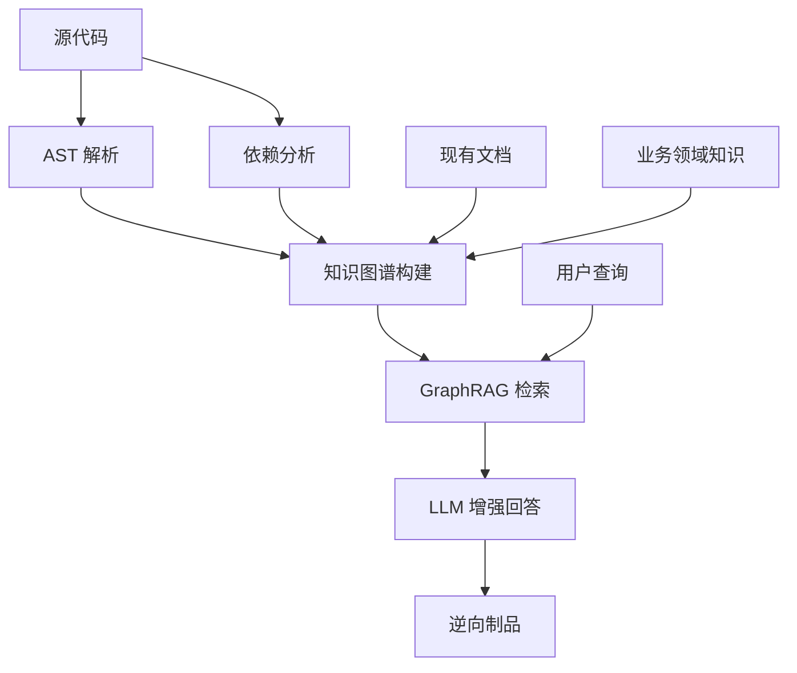
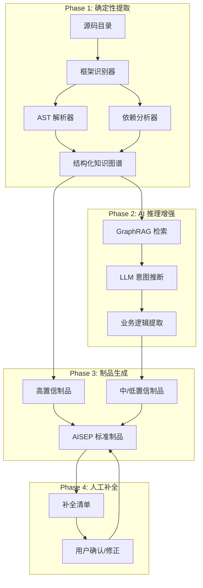

# AI 辅助系统逆向工程：行业调研与 AISEP Onboard 改进方案

> 调研时间：2026-03-15 | 覆盖 7 轮搜索 + 内部文档审阅

---

## 一、行业全景：谁在做，怎么做

### 1.1 三大技术路线

| 路线 | 代表方案 | 核心原理 | 适用场景 |
|------|----------|----------|----------|
| **静态分析 + LLM 推理** | ThoughtWorks GraphRAG, Kodesage, CodeBoarding | AST/依赖图 → 知识图谱 → RAG 增强 LLM 理解 | 有源码、需深度理解逻辑 |
| **视觉逆向** | Replay.build | 录制运行时视频 → AI 提取 UI/交互/状态机 | 无源码或源码极烂、关注用户旅程 |
| **Agentic AI 全自动** | Hexaware RapidX, Qlerify | 多 Agent 协作，自动发现→分析→生成制品 | 企业级大规模遗留系统 |

> [!IMPORTANT]
> **Gartner 预测**：到 2026 年，40% 的遗留系统现代化项目将采用 AI 辅助逆向工程（2023 年不到 10%）。ThoughtWorks 已将「Using GenAI to understand legacy codebases」列为 **Adopt** 级别（2025.11 Technology Radar）。

### 1.2 关键方案深入

#### ThoughtWorks GraphRAG 架构



**核心思路**：不依赖 LLM 直接「读懂」代码，而是先用静态分析构建**结构化知识图谱**（实体关系、调用链、依赖图），再用 RAG 为 LLM 注入上下文。实测将 10,000 行 COBOL 逆向时间从 6 周缩短至 2 周。

**AISEP 启发**：当前 onboard 工作流直接让 LLM 读代码推断，缺少「先构建结构化中间表示」这一步。

---

#### Replay.build 视觉逆向

| 维度 | 说明 |
|------|------|
| **输入** | 录制遗留系统的实际操作视频 |
| **分析** | AI 提取 UI 组件、状态变化、交互流程、业务流程 |
| **输出** | React 代码 + Design System + 架构蓝图 + E2E 测试 |
| **效率** | 每屏幕从 40 小时降至 ~4 小时（10x） |

**AISEP 启发**：对于 Odoo 模块逆向，UI 层（views/*.xml）的逆向可以借鉴「从运行时行为提取意图」的思路。当前只做静态 XML 解析，如果结合实际运行截图，可以大幅提升 view 层的理解准确度。

---

#### Hexaware RapidX Agentic AI

**特色**：采用多 Agent 架构：
- **Discovery Agent**：扫描代码库，构建依赖图
- **Analysis Agent**：提取业务规则、识别死代码
- **Documentation Agent**：生成制品（蓝图、规格书）
- **Orchestrator Agent**：协调三者，管理流程

**AISEP 启发**：当前 onboard 是单一 AI 执行 R1-R6 全流程，可以考虑**分工 Agent** 模式提高精度。

---

#### CodeBoarding & RECoRD

- **CodeBoarding** (GitHub 开源)：静态分析 + LLM Agent → 将代码库转化为交互式高层架构图，专注 onboarding 场景
- **RECoRD** (学术)：多 Agent LLM 方法，将代码库逆向为关系图，形式化理解复杂算法

---

### 1.3 共识趋势

| 趋势 | 说明 |
|------|------|
| **混合方法论** | 静态分析（确定性高）+ LLM（理解意图）= Human-in-the-Loop |
| **Knowledge Graph 是核心** | 不直接让 LLM 读全部代码，而是先构建结构化表示 |
| **Progressive Disclosure** | 渐进式揭示复杂度：先架构鸟瞰 → 模块概览 → 代码细节 |
| **置信度分级** | 声明式提取（高置信）vs AI 推断（中等）vs 业务意图（低/需人工） |
| **Agentic 多 Agent** | 分工协作比单一 Agent 效果更好 |

---

## 二、AISEP Onboard 现状评估

### 2.1 已有优势

| 维度 | 现状 | 评级 |
|------|------|------|
| **阶段划分** | R1-R6 清晰的6阶段流水线 | ✅ 优秀 |
| **置信度系统** | 三级 (≥0.9 / 0.7-0.89 / <0.7) + 补全清单 | ✅ 优秀 |
| **Odoo 特化** | 详细的逆向规则矩阵（代码→制品映射） | ✅ 优秀 |
| **人工补齐机制** | 三类（确认/意图/演进）+ 批量交互 | ✅ 优秀 |
| **增量演进** | Greenfield vs Brownfield 路径 + changes/ 隔离 | ✅ 优秀 |
| **制品对齐** | 逆向到 AISEP 标准制品格式 | ✅ 优秀 |

### 2.2 待改进的差距

| 差距 | 现状 | 行业做法 | 影响 |
|------|------|----------|------|
| **缺少知识图谱层** | 直接 LLM 读代码 | 先 AST→KG，再 GraphRAG 辅助 | 大项目理解深度不足 |
| **单一 Agent 执行** | R1-R6 全部由一个 AI 会话执行 | 多 Agent 分工（发现/分析/文档） | 单次 context 溢出风险 |
| **缺少运行时分析** | 纯静态分析 | 静态 + 动态（录屏/调试跟踪） | 业务流程理解不完整 |
| **仅 Odoo 框架** | 高度 Odoo 特化 | 通用框架 + 框架特化插件 | 扩展性不足 |
| **缺少架构鸟瞰图** | 从模型细节开始 | 先生成全局架构图 | 缺乏宏观理解阶段 |
| **无渐进式揭示** | 一次性提取全部信息 | Progressive Disclosure 分层加载 | context 管理不佳 |

---

## 三、改进方案

### 3.1 架构升级：引入知识图谱中间层



**核心改变**：在 LLM 推理之前，先用确定性方法构建知识图谱。这符合 AISEP constitution 的「高确定性先行」原则。

### 3.2 Multi-Pass Progressive Disclosure

将现有的 R1-R6 改造为**三层渐进式分析**：

| 层级 | 名称 | 做什么 | 产出 |
|------|------|--------|------|
| **L0 鸟瞰** | Architecture Scan | 文件树 + 入口识别 + 依赖图 + 框架检测 | `architecture-overview.md` |
| **L1 模块** | Module Analysis | 逐模块提取（模型/视图/安全/路由） | 每模块的 `module-profile.yaml` |
| **L2 细节** | Deep Dive | 业务逻辑推断 + 意图分析 + 边界识别 | 完整 AISEP 制品集 |

**好处**：
1. L0 可以在几秒内完成，让用户快速确定范围
2. L1 按模块增量，context 不会溢出
3. L2 只对用户确认的范围做深度分析

### 3.3 通用化框架 + 插件架构

```yaml
# 框架适配器接口（概念设计）
framework_adapter:
  interface:
    detect: "判断源码是否属于该框架"
    extract_metadata: "提取项目元数据"
    extract_models: "提取数据模型"
    extract_views: "提取视图/UI层"
    extract_security: "提取安全规则"
    extract_routes: "提取路由/API"
    extract_business_logic: "提取业务逻辑"
    
  adapters:
    odoo17:        # 已实现
      detect: "__manifest__.py 存在"
      models: "models/*.py → ORM 解析"
      views: "views/*.xml → XML 解析"
    django:        # 待实现
      detect: "manage.py + settings.py"
      models: "models.py → Django ORM 解析"  
      views: "views.py → URL conf 解析"
    nextjs:        # 待实现
      detect: "next.config.* + pages/ or app/"
      models: "Prisma schema / API routes"
      views: "pages/*.tsx → 组件树"
    generic_python: # 通用 fallback
      detect: "*.py 文件存在"
      models: "class 定义提取"
```

### 3.4 改进后的阶段设计

```
R0: Framework Detection + Architecture Overview (NEW)
    ├── 文件树扫描 + 框架识别
    ├── 全局架构鸟瞰图生成
    └── 🗣️ 用户确认分析范围

R1: Dependency Discovery (ENHANCED)
    ├── 知识图谱构建（AST + 依赖 DAG）
    ├── 模块分类（标准 vs 自定义）
    ├── 拓扑排序
    └── 🗣️ 用户确认模块范围

R2: Domain Reconstruction (ENHANCED)  
    ├── 确定性提取（声明式代码 → confidence ≥ 0.9）
    ├── GraphRAG 辅助推理（业务逻辑 → confidence 0.7-0.89）
    ├── Bounded Context 推断
    └── 🗣️ 逐模块展示 + 用户确认

R3: Artifact Alignment (KEPT)
    └── 逆向数据 → AISEP 标准制品

R4: Completion Checklist (KEPT)
    └── 低置信度项 → 结构化补全问题

R5: Slice Inference (KEPT)
    └── 菜单/聚合/流程 → Slice 划分

R6: Registration + Incremental Mode (KEPT)
    └── 注册 + 进入正向推进
```

### 3.5 新增：运行时辅助分析（可选扩展）

对于有运行环境的项目，增加可选的运行时分析能力：

| 能力 | 实现方式 | 价值 |
|------|----------|------|
| **截图分析** | 浏览器截图 + 视觉 LLM | 验证 view 逆向的准确性 |
| **API 追踪** | HTTP 请求/响应记录 | 补充 controller 层理解 |
| **数据采样** | 查询 demo 数据库 | 理解数据结构和关系 |

> [!NOTE]
> 这是 **可选增强**，不是必须步骤。核心逆向流程仍以静态分析为主。

---

## 四、与现有系统的对齐

### 4.1 不变的核心

保持 AISEP 已有的这些强项不变：

- ✅ 置信度三级评估体系
- ✅ 人工补齐的三类分类（确认/意图/演进）
- ✅ 补全清单的批量交互策略（5-8个/批）
- ✅ Brownfield changes/ 增量演进模式
- ✅ 逆向制品的 `source: "onboard"` 标记
- ✅ Gate 检查清单体系

### 4.2 重要改变

| 改变 | 原因 | 风险 |
|------|------|------|
| 新增 R0 阶段 | 先鸟瞰再深入，符合 Progressive Disclosure | 低 — 增量添加 |
| 知识图谱中间层 | 提高大项目理解精度 | 中 — 需要定义 KG schema |
| 框架插件化 | 支持更多技术栈 | 中 — 需设计通用接口 |
| Multi-Pass 分析 | 管理 context 预算 | 低 — 自然映射到 L0/L1/L2 |

### 4.3 实施优先级建议

| 优先级 | 改进项 | 工作量 | 价值 |
|--------|--------|--------|------|
| P0 | 新增 R0 架构鸟瞰阶段 | ~2h | 高 — 立刻可用 |
| P0 | Multi-Pass 渐进分析整合到工作流 | ~3h | 高 — 改善 context 管理 |
| P1 | 通用框架适配器接口设计 | ~4h | 高 — 可扩展性 |
| P1 | 知识图谱 schema 设计（概念层面） | ~3h | 高 — 理解深度 |
| P2 | Django 适配器实现 | ~3h | 中 — 扩展覆盖 |
| P2 | Next.js 适配器实现 | ~3h | 中 — 扩展覆盖 |
| P3 | 运行时分析集成（截图/API追踪） | ~5h | 中 — 可选增强 |

---

## 五、业界工具速查表

| 工具/平台 | 定位 | 开源? | AISEP 借鉴点 |
|-----------|------|-------|-------------|
| **ThoughtWorks GraphRAG** | 知识图谱 + RAG 架构模式 | 模式（非产品） | KG 中间层设计 |
| **Kodesage** | 企业级代码理解平台 | ❌ 商业 | 自然语言查询代码库 |
| **CodeBoarding** | 代码 Onboarding 可视化 | ✅ GitHub | 架构图自动生成 |
| **Qlerify** | DDD 逆向 + 代码生成 | ❌ 商业 | DDD 对齐的逆向方法 |
| **Replay.build** | 视觉逆向 | ❌ 商业 | 运行时行为提取思路 |
| **Hexaware RapidX** | Agentic AI 逆向平台 | ❌ 商业 | 多 Agent 分工模式 |
| **IBM Watsonx** | 企业遗留系统现代化 | ❌ 商业 | COBOL/RPG 逆向 |
| **LLM4Decompile** | 二进制→C 源码 | ✅ 学术 | 底层逆向编译 |
| **ContextDX** | Claude 插件，活文档架构视图 | ✅ 插件 | 语义分类组件 |

---

## 六、参考文献与来源

1. ThoughtWorks Technology Radar — GraphRAG (Trial, 2025.04) / GenAI for legacy codebases (Adopt, 2025.11)
2. Gartner 预测：2026 年 40% 遗留现代化采用 AI 逆向工程
3. CodeBoarding GitHub — 静态分析 + LLM Agent 代码 Onboarding
4. RECoRD (OpenReview) — 多 Agent LLM 逆向为关系图
5. Hexaware RapidX — Agentic AI 逆向工程平台
6. Replay.build — 视觉逆向工程框架
7. Qlerify — AI-powered DDD 逆向工程
8. Cloudflare / Anthropic — Progressive Disclosure for AI Agents
