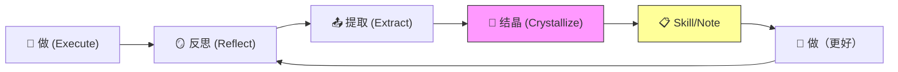

# 本体论作为 AISEP 底层信息架构：深度分析

> 深挖 Palantir Ontology → AISEP 全局信息架构 + 学习循环 + A2A 多 Agent 自进化

---

## 一、Palantir Ontology 的核心抽象

### 三要素模型

Palantir Foundry 的本体论只有**三个核心抽象**，但能建模一切：

```
Object Type（是什么）+ Link Type（怎么关联）+ Action Type（能做什么）
```

| 抽象 | 类比 | Palantir 示例 | AISEP 映射 |
|------|------|--------------|-----------|
| **Object Type** | 名词 | Employee, Aircraft, Order | project, model, field, skill |
| **Link Type** | 动词/介词 | reportsTo, belongsTo, depends_on | produces, informs, evolves_from |
| **Action Type** | 操作 | AssignEmployee, ApproveOrder | create_slice, pass_gate, run_onboard |

### 三个设计原则

| 原则 | 含义 | AISEP 对照 |
|------|------|-----------|
| **Shared Asset** | 本体论是组织共享资产，不是私有数据 | AISEP 的 glossary + domain-model 就该是全项目共享的 |
| **Natural Language Mapping** | Object Type 名称要让业务人员能懂 | 用中文业务术语，不用技术编码 |
| **Pragmatism** | 先交付价值，不追求完美本体论 | 先建核心 Object Types，渐进扩展 |

> [!IMPORTANT]
> Palantir 特别强调：**孤立的 Object 是 red flag**。如果一个 Object Type 没有 Link Type 连接到其他 Object，说明建模不完整。在 AISEP 中同理——每个制品都应该可追溯到来源。

---

## 二、AISEP 全局本体论设计

### 设计哲学

AISEP 不只是一个流程管理工具，它管理的是**三种资产**：

```
📦 项目制品（What we build）
📚 知识资产（What we know）  
🔄 过程记录（How we got here）
```

本体论的作用是用统一的语义层把这三者连接起来。

### Object Types（7 层）

```yaml
ontology:
  # ─── 第 1 层：项目层 ───
  project:
    properties: [id, name, status, source, created_at]
    description: "AISEP 管理的项目"
    
  slice:
    properties: [id, name, stage, priority, crud_coverage]
    description: "项目内的功能切片"
    
  change:
    properties: [id, title, type, risk, status]
    description: "Brownfield 项目的变更单元"

  # ─── 第 2 层：领域层 ───
  domain_entity:
    properties: [name, technical_name, bounded_context, confidence]
    description: "DDD 实体/聚合（来自 domain-model.yaml）"
    
  business_rule:
    properties: [id, description, rationale, confidence]
    description: "业务规则（约束、计算逻辑等）"
    
  glossary_term:
    properties: [term, definition, synonyms, source]
    description: "术语表条目"

  # ─── 第 3 层：架构层 ───
  architecture_component:
    properties: [name, type, framework, source_file]
    description: "视图/安全规则/API/报表等架构元素"

  # ─── 第 4 层：知识层 ───
  research:
    properties: [id, title, date, tags, status]
    description: "调研报告（已沉淀）"
    
  cognitive_note:
    properties: [id, concept, one_liner, analogy]
    description: "认知笔记（学习产出）"
    
  skill:
    properties: [name, category, maturity, trigger_condition]
    description: "方法论/框架知识 SKILL.md"
    
  decision:
    properties: [id, decision, rationale, date, source_research]
    description: "设计决策记录"

  # ─── 第 5 层：过程层 ───
  gate_record:
    properties: [stage, slice, passed, date, evidence]
    description: "Gate 通过记录"
    
  reasoning_trace:
    properties: [id, stage, module, hypotheses]
    description: "AI 推理链记录"

  # ─── 第 6 层：进化层 ───
  evolution_rule:
    properties: [id, category, trigger, content, approved_by]
    description: "系统进化规则"
    
  interaction_pattern:
    properties: [id, pattern, frequency, effectiveness]
    description: "交互模式识别"

  # ─── 第 7 层：Agent 层 ───（🆕 为 A2A 准备）
  agent_card:
    properties: [name, role, capabilities, preferred_context]
    description: "Agent 能力描述（A2A Agent Card）"
    
  agent_session:
    properties: [id, agent, task, start_time, status]
    description: "Agent 执行会话记录"
```

### Link Types（12 种）

```yaml
link_types:
  # 项目关系
  - type: "contains"          # project → slice / change
  - type: "depends_on"        # slice → slice / module → module
  
  # 知识关系
  - type: "informs"           # research → decision
  - type: "produces"          # project → domain_entity / architecture_component
  - type: "extracted_from"    # cognitive_note → gate_record / research
  - type: "crystallized_as"   # reasoning_trace → skill（🆕 知识结晶）
  
  # 演进关系
  - type: "evolves_from"      # v2 → v1（版本演进）
  - type: "supersedes"        # new → old（替代关系）
  - type: "triggers"          # interaction_pattern → evolution_rule
  
  # 追溯关系
  - type: "references"        # any → any（通用引用）
  - type: "validated_by"      # decision → gate_record
  - type: "delegated_to"      # agent_session → agent_card（🆕 A2A）
```

### Action Types（8 种）

```yaml
action_types:
  - type: "onboard"           # 逆向接管 → 创建 project + entities
  - type: "pass_gate"         # Gate 通过 → 更新 stage + 创建 gate_record
  - type: "crystallize"       # 知识结晶 → reasoning_trace → skill / cognitive_note
  - type: "evolve"            # 系统进化 → 创建 evolution_rule
  - type: "precipitate"       # 沉淀 → 对话产物 → research / cognitive_note
  - type: "delegate"          # 委托 → 分配任务给另一个 Agent（A2A）
  - type: "review"            # 审核 → 人审核 Agent 产出
  - type: "promote"           # 提升 → idea → project / draft → approved
```

---

## 三、学习循环：从做中整理 → 沉淀成 Skill

> 对应 note.md：「不会做，先思考学习，从做中整理方法，方法论，沉淀成skill，完善」

### 知识结晶循环（Knowledge Crystallization Cycle）

业界有一个被称为 **Recursive Knowledge Crystallization** 的模式（2025 前沿）：

```
做 → 反思 → 提取 → 结晶 → 应用 → 做（更好）→ ...
```

映射到 AISEP：



| 阶段 | AISEP 中的实现 | 触发点 |
|------|---------------|--------|
| **做** | S5 代码实现 / Onboard 逆向 | `/pipeline` / `/onboard` |
| **反思** | S8 复盘 / `/tidy` 上下文审计 | 阶段结束时 |
| **提取** | 认知笔记提取 / 经验识别 | S8 Step 2-3 |
| **结晶** | 写入 SKILL.md 或 cognitive_note | S8 Step 4 / `/tidy` Step 10 |
| **应用** | 下一个 Slice/项目加载 Skill | Workflow context.skills |

### 结晶的三种产出

| 产出 | 适合内容 | 成熟度 |
|------|----------|--------|
| **cognitive_note** | 一次性洞察、概念理解 | 低 — 单次经验 |
| **decision** | 设计选择的记录 | 中 — 有理由但未验证普适性 |
| **skill (SKILL.md)** | 反复验证的方法论/框架知识 | 高 — 多次项目验证 |

### 结晶成熟度路径

```
cognitive_note（单次经验）
    ↓ 第2次遇到类似场景，验证了这个经验
decision（有理由的选择）
    ↓ 第3+次验证，提炼出通用模式
skill_draft（SKILL.md 草案）
    ↓ 跨项目验证通过
skill（正式 SKILL.md）
```

在本体论中用 **evolves_from** 和 **crystallized_as** Link Types 追踪这条演进路径。

---

## 四、A2A 多 Agent 自进化

> 对应 note.md：「A2A 自进化，多个agent针对一个话题探讨，人审核」

### Google A2A 协议核心概念

Google 2025.04 发布的 A2A（Agent-to-Agent）开放协议：

| 概念 | 说明 | AISEP 映射 |
|------|------|-----------|
| **Agent Card** | JSON 格式的能力描述书 | 本体论中的 `agent_card` Object Type |
| **Task Flow** | 异步任务委托和状态同步 | `delegate` Action Type |
| **Capability Discovery** | 运行时发现其他 Agent 的能力 | 基于 Skill 注册表的匹配 |
| **Experience Tuning** | 基于使用偏好的调优 | 进化层的 `interaction_pattern` |

### AISEP 中的多 Agent 讨论模式

当前 AISEP 是单 Agent（我）执行全流程。引入 A2A 思想后，可以设计**虚拟多 Agent 讨论**模式：

```yaml
discussion_protocol:
  trigger: "设计决策点 / 置信度分歧 / 进化评估"
  
  agents:
    - role: "分析者"
      focus: "技术可行性 + 实现复杂度"
      perspective: "工程师视角"
      
    - role: "质疑者"
      focus: "反例 + 风险 + 已知陷阱"
      perspective: "审计师视角"
      
    - role: "整合者"
      focus: "综合论点 + 提出折中方案"
      perspective: "架构师视角"
  
  process:
    1. "分析者提出方案 + 理由"
    2. "质疑者提出反对意见 + 证据"
    3. "整合者综合两方，产出决策选项"
    4. "人审核：选择 / 修正 / 否决"
  
  output:
    type: "decision"
    with_reasoning_trace: true
    human_approved: true
```

### 这不是字面上的多个 AI

> [!NOTE]
> 在 AISEP 当前架构（单 AI Agent + 人类用户）中，「多 Agent 讨论」实际上是**单 Agent 的多视角推理**——像一个人戴不同的帽子思考（Edward de Bono 的六顶思考帽方法论）。
> 
> 但本体论层面为未来真正的 A2A 多 Agent 做了预留（`agent_card` + `delegate` + `agent_session`）。

### 自进化循环

```
Agent 执行任务
    ↓
产出 reasoning_trace（推理链）
    ↓
人审核 + 反馈
    ↓
提取 interaction_pattern（什么做法效果好/差）
    ↓
触发 evolution_rule（进化规则更新）
    ↓
Skill/Workflow 更新
    ↓
Agent 下次执行更好
```

---

## 五、与当前 AISEP 系统的映射

### 已有的 Object Types（即使没明确叫这个名字）

| 本体论 Object Type | AISEP 当前载体 | 差距 |
|-------------------|---------------|------|
| `project` | `registry.yaml` | ✅ 已有 |
| `slice` | `slice-plan.yaml` | ✅ 已有 |
| `domain_entity` | `domain-model.yaml` | ✅ 已有 |
| `business_rule` | `domain-model.yaml` 内嵌 | ⚠️ 没有独立 ID |
| `glossary_term` | `glossary.yaml` | ✅ 已有 |
| `architecture_component` | `architecture.yaml` | ✅ 已有 |
| `cognitive_note` | `.aisep/knowledge/entries/` | ✅ 已有 |
| `gate_record` | `gate-log.yaml` | ✅ 已有 |
| `skill` | `.agents/skills/*/SKILL.md` | ✅ 已有 |
| `decision` | 分散在各处 | ❌ 缺失独立记录 |
| `research` | 刚建立 `.aisep/docs/research/` | ✅ 刚建 |
| `reasoning_trace` | ❌ 不存在 | ❌ 缺失 |
| `evolution_rule` | `.aisep/evolution/` | ✅ 已有 |
| `agent_card` | ❌ 不存在 | ❌ 未来需求 |

### 核心差距

1. **缺乏跨层关联**：project → domain_entity → business_rule 的链条存在，但是**隐式**的（靠文件路径约定），没有显式的 Link Type 声明
2. **decision 层缺失**：设计决策散布在对话中，没有持久化为独立 Object
3. **reasoning_trace 不存在**：AI 的推理过程是黑盒，无法回溯
4. **知识结晶路径未形式化**：cognitive_note → skill 的演进是人为判断，没有 evolves_from 追踪

---

## 六、落地路径

### 关键洞察：不需要建一个「本体论引擎」

> [!IMPORTANT]
> AISEP 是 **yaml 文件 + AI Agent** 的轻量架构。本体论不需要用数据库实现，只需要：
> 1. 在 yaml 文件中加入 `_type` 和 `_links` 字段
> 2. 让 AI Agent 理解并维护这些关系
> 3. 用 `/tidy` 做一致性校验

### 渐进实施

| 阶段 | 做什么 | 成本 | 价值 |
|------|--------|------|------|
| **Phase 0** | 在已有 yaml 中增加 `_type` 标注 | ~1h | 让 AI 知道「这是什么」 |
| **Phase 1** | 增加 `decision-log.yaml`，独立记录设计决策 | ~2h | 填补最大缺口 |
| **Phase 2** | 在 Onboard 中产出 `knowledge-graph.yaml` | 已完成 | Onboard V2 已设计 |
| **Phase 3** | 知识结晶路径形式化（cognitive_note → skill 演进追踪） | ~3h | 学习循环闭合 |
| **Phase 4** | 多视角讨论模式在关键决策点试用 | ~2h | AI+人共建质量提升 |
| **Future** | 真正的 A2A 多 Agent（agent_card + delegate） | TBD | 等工具链成熟 |
