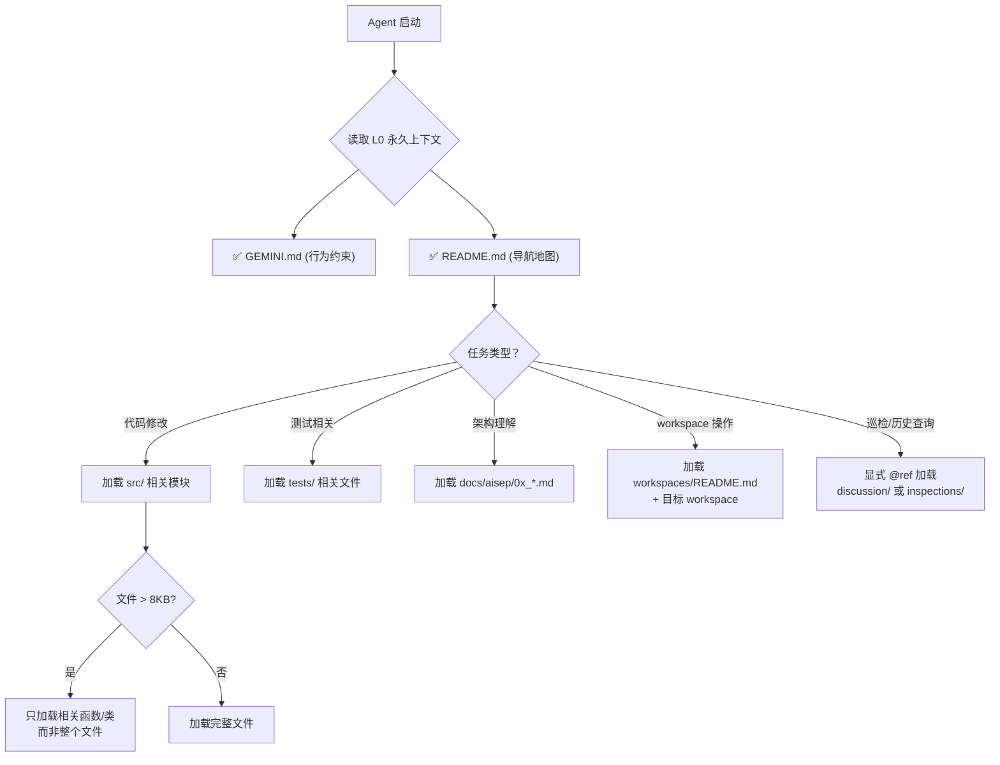

> **来源**:老库 new_AISEP(2026-04)/docs/ai_context_standard.md。本文为方法论/知识沉淀,非当前 harness 现行强制规范(契约 01:诚实标注建议层)。token 冷热分级标准,与 context-loading-protocol 互补。

# AISEP AI 上下文管理标准

> **文档类型**：工程标准 (Engineering Standard)
> **适用范围**：AISEP 全项目 — 所有 Agent、开发者、CI 流程
> **版本**：v1.0
> **最后更新**：2026-03-30
> **关联文件**：[.geminiignore](../../.geminiignore) · [directory_guide.md](./directory_guide.md) · [GEMINI.md](../../GEMINI.md)

---

## 1. 目标

本标准定义 AISEP 项目中 **AI Agent 上下文管理** 的规则体系，确保：

1. **Token 效率**：Agent 每次任务的上下文预算用在刀刃上
2. **信噪比**：排除噪声文件，Agent 聚焦核心代码和活跃文档
3. **安全性**：敏感信息不被 AI indexing 吸入
4. **可预测性**：开发者能明确知道 Agent "看得见"和"看不见"什么

---

## 2. 核心概念：三层上下文模型

借鉴 [Progressive Disclosure Pattern](../aisep/README.md)，AISEP 将 AI 可及的文件分为三个加载层级：

```
┌─────────────────────────────────────────────────┐
│  L0  永久上下文 (Always Loaded)                   │
│  → GEMINI.md · README.md — Agent 每次启动必读      │
│  → 设计决策边界 + 项目导航地图                       │
│  预算：< 5K token                                 │
├─────────────────────────────────────────────────┤
│  L1  按需索引 (Indexed, Loaded on Demand)         │
│  → src/ · tests/ · schemas/ · docs/aisep/01~08   │
│  → codebase_indexing 语义检索后按需加载             │
│  预算：单次加载 < 20K token                        │
├─────────────────────────────────────────────────┤
│  L2  显式引用 (Excluded from Index, Manual @ref)  │
│  → .geminiignore 排除的文件                        │
│  → 只有通过 @file 显式引用才能进入上下文              │
│  → discussion/ · inspections/ · voice_logs/       │
│  预算：0 token (除非显式引用)                       │
└─────────────────────────────────────────────────┘
```

### 关键规则

| 层级 | 行为 | 典型文件 | 进入上下文的方式 |
|------|------|---------|---------------|
| **L0** | 永久加载 | `GEMINI.md`, `README.md` | 自动 — Agent 启动即加载 |
| **L1** | 索引后按需 | `src/**/*.py`, `tests/**`, `docs/aisep/*.md` | 语义检索命中时自动加载 |
| **L2** | 完全排除 | `.geminiignore` 中列出的路径 | 仅通过 `@file` 显式引用 |

---

## 3. Ignore 策略详解

### 3.1 文件层级关系

```
.gitignore          ← Git 版本控制排除（已有）
    ↓ 自动继承
.geminiignore       ← AI 上下文额外排除（增量层）
    ↓ 覆盖
@file 显式引用       ← 无视一切 ignore，强制加载
```

> **重要**：`.geminiignore` 是 `.gitignore` 的**增量补充**，不是替代。
> `.gitignore` 已排除的（如 `.venv/`, `node_modules/`）AI 也会自动排除。
> `.geminiignore` 用于排除那些**在 Git 中保留但 AI 不需要看**的文件。

### 3.2 九大排除分类

| # | 类别 | 排除模式 | 理由 | 估算 Token 节省 |
|---|------|---------|------|----------------|
| 1 | 运行时/构建产物 | `.agents/tmp/`, `__pycache__/` | 250MB+ 无代码价值 | ~50K |
| 2 | 前端依赖 | `dashboard-ui/node_modules/` | 145MB 第三方依赖 | ~100K+ |
| 3 | 冷归档文档 | `docs/aisep/discussion/`, `inspections/` | 已完成的历史讨论 | ~33K |
| 4 | 语音日志 | `voice_logs/` | 运行时交互记录 | ~4K |
| 5 | 历史原型 | `spike/` | Phase 1 已完成 | ~10K |
| 6 | 工作区运行时 | `*/testing_env/`, `*/.runtime/` | Docker 沙箱/快照 | ~5K |
| 7 | OS/IDE 噪声 | `.DS_Store`, `*.log` | 系统文件 | 微量 |
| 8 | 锁文件 | `uv.lock`, `package-lock.json` | 依赖解析树 | ~40K |
| 9 | Git 内部 | `.git/` | 版本控制元数据 | 大量 |

### 3.3 白名单例外（不应排除的文件）

以下文件**绝对不能**放入 `.geminiignore`：

| 文件/目录 | 理由 |
|----------|------|
| `GEMINI.md` | L0 永久上下文，Agent 行为约束源 |
| `README.md` | L0 项目导航地图 |
| `src/**` | 核心代码，Agent 的工作对象 |
| `tests/**` | 测试代码，Agent 需要理解测试模式 |
| `schemas/**` | IR schema 是代码生成的基础约束 |
| `docs/aisep/01~08*.md` | 核心设计文档，Agent 需要理解架构 |
| `workspaces/README.md` | workspace 结构规范 |
| `.agents/workflows/` | Agent 工作流定义 |
| `pyproject.toml` | 依赖和项目配置 |

---

## 4. 文件分级标准 (HOT / WARM / COLD)

### 4.1 分级定义

| 温度 | 定义 | AI 行为 | 对应层级 |
|------|------|---------|---------|
| 🔴 **HOT** | Agent **每次任务**必须理解的文件 | L0 永久加载 / L1 高频命中 | 不可 ignore |
| 🟡 **WARM** | Agent **按需查阅**的文件 | L1 索引后按检索命中加载 | 不可 ignore |
| 🔵 **COLD** | 已完成/历史性文件，**几乎不被引用** | L2 排除索引 | **必须 ignore** |

### 4.2 AISEP 文件分级清单

```
🔴 HOT — 永久/高频上下文
├── GEMINI.md                          # Agent 行为约束
├── README.md                          # 项目导航
├── pyproject.toml                     # 依赖配置
├── src/aisep/**                       # 核心代码
├── tests/**                           # 测试代码
├── schemas/**                         # IR 约束 schema
├── docs/ai_context_standard.md        # 本文件
└── docs/directory_guide.md            # 目录导航

🟡 WARM — 按需索引
├── docs/aisep/01~08*.md               # 核心设计文档
├── docs/aisep/README.md               # 设计资产索引
├── docs/aisep/decision_log.md         # 决策日志（建议瘦身）
├── docs/aisep/design_workflow.md      # 设计工作流
├── docs/api_reference.md              # API 参考
├── workspaces/README.md               # workspace 结构规范
├── workspaces/complex_demo/           # 标准示例
├── .agents/workflows/                 # 工作流定义
├── .agents/data/standards/            # 工程标准
└── dashboard-ui/src/                  # 前端源码（9文件）

🔵 COLD — 排除索引 (.geminiignore)
├── docs/aisep/discussion/             # 历史讨论 (15 files, ~53KB)
├── docs/aisep/inspections/            # 巡检报告 (4 files, ~34KB)
├── docs/claude_agent_sdk_notes.md     # 早期学习笔记
├── spike/                             # Phase 1 原型
├── voice_logs/                        # 语音交互记录
├── .agents/tmp/                       # 临时实验
├── workspaces/*/testing_env/          # Docker 沙箱
└── *.lock                             # 依赖锁文件
```

### 4.3 温度迁移规则

文件温度不是永久的。以下情况触发迁移：

| 迁移方向 | 触发条件 | 操作 |
|---------|---------|------|
| WARM → COLD | 超过 30 天未被任何 Agent 引用 | 移入 `archive/` + 加入 `.geminiignore` |
| COLD → WARM | 被 `@file` 显式引用 2+ 次 | 从 `.geminiignore` 移除 |
| WARM → HOT | 被纳入 `GEMINI.md` 或 `README.md` 直接引用 | 确保不在 ignore 中 |
| 新文件默认 | 创建时 | 默认 WARM，除非明确属于 COLD 类别 |

---

## 5. 单文件尺寸标准

### 5.1 尺寸阈值

| 文件类型 | 最大推荐尺寸 | 触发动作 |
|---------|------------|---------|
| Python 模块 (`.py`) | **300 行 / 8KB** | 拆分为子模块 |
| Markdown 文档 (`.md`) | **200 行 / 5KB** | 拆分或归档旧内容 |
| YAML 配置 | **100 行 / 3KB** | 拆文件 |
| Jinja2 模板 (`.j2`) | **150 行 / 5KB** | 拆为 partial |
| `current_task.md` | **100 行 / 3KB** | 严格单一任务，不累积 |

### 5.2 当前违规文件

| 文件 | 当前大小 | 标准 | 状态 |
|------|---------|------|------|
| `src/aisep/core/orchestrator.py` | 20KB / ~500L | 8KB / 300L | ⚠️ 需拆分 |
| `docs/aisep/decision_log.md` | 26KB / 478L | 5KB / 200L | ⚠️ 需归档旧条目 |
| `docs/aisep/02_roles_interaction.md` | 18KB | 5KB | ⚠️ 可接受（核心设计文档例外） |
| `docs/aisep/01_vision_scope.md` | 17KB | 5KB | ⚠️ 可接受（核心设计文档例外） |
| `workspaces/hitl_demo/current_task.md` | 10KB | 3KB | ❌ 严重超标 |
| `workspaces/phase9_demo/current_task.md` | 10KB | 3KB | ❌ 严重超标 |

> **例外条款**：核心设计文档 (`01~08` 系列) 天然内容密集，允许超标但应尽量控制在 **20KB** 以内。`decision_log.md` 无此例外。

---

## 6. SSOT (Single Source of Truth) 规则

### 6.1 铁律

> **每个知识点有且只有一个权威文件。其他文件只能链接引用，不能复述。**

### 6.2 权威文件映射表

| 知识点 | 权威文件 (SSOT) | 其他文件做法 |
|--------|----------------|-------------|
| Agent 行为约束 | `GEMINI.md` | 用 `[→ 参见 GEMINI.md](../../GEMINI.md)` |
| 项目现状 & CLI | `README.md` | 不再复述 CLI 命令 |
| Workspace 结构 | `workspaces/README.md` | 用 `[→ 参见](../../workspaces/README.md)` |
| 目录规范 | `docs/directory_guide.md` | 08_project_structure 引用此处 |
| 设计资产索引 | `docs/aisep/README.md` | 不在其他文件重复列举 |
| AI 上下文标准 | `docs/ai_context_standard.md` (本文件) | 其他文档引用此处 |

### 6.3 违反检测

```bash
# 检查是否有多个文件定义了同一 workspace 结构
grep -rl "01_req\|02_ir\|03_docs\|04_odoo" docs/ workspaces/README.md
# 预期：只在 SSOT 文件中出现

# 检查是否有多个文件复述 CLI 命令
grep -rl "uv run python -m aisep" docs/ --include='*.md'
# 预期：只在 README.md 中出现
```

---

## 7. Agent 上下文加载决策树

当 Agent 需要理解项目时，按以下决策树加载上下文：



---

## 8. 维护与审计

### 8.1 为什么需要定期更新 ignore？

`.geminiignore` 是静态文件，但项目是动态演化的。以下场景会导致 ignore 腐化：

| 腐化场景 | 后果 | 检测方式 |
|---------|------|---------|
| 新增顶层目录未分级 | 噪声目录被 AI 索引 | `new_unclassified` 检查 |
| WARM 文件长期不活跃 | 占据索引预算但无贡献 | `cold_drift` 检查 (30 天阈值) |
| 文件持续膨胀超标 | 单文件吃掉过多 context | `file_size` 检查 |
| SSOT 违规扩散 | 多源真相→Agent 交叉验证浪费 token | `ssot` 检查 |
| HOT 文件被误排除 | Agent 丢失关键上下文 | `hot_protection` 检查 |

### 8.2 自动化审计脚本

项目内置了自动化审计工具，执行 8 项检查：

```bash
# 标准审计 — 人类可读报告
uv run python scripts/audit_ai_context.py

# 带修复建议
uv run python scripts/audit_ai_context.py --fix

# JSON 输出 (CI/自动化消费)
uv run python scripts/audit_ai_context.py --json
```

也可通过 workflow 触发：`/context-audit`

审计脚本的 8 项检查：

| # | 检查项 | 级别 | 说明 |
|---|--------|------|------|
| 1 | `.geminiignore` 存在性 | ERROR | 文件不存在 = 上下文完全无过滤 |
| 2 | COLD 路径覆盖度 | WARNING | COLD_PATTERNS 是否都在 ignore 中 |
| 3 | HOT 文件保护 | ERROR | HOT 文件被 ignore = 致命 |
| 4 | 文件尺寸违规 | WARNING | Python 8KB / MD 5KB / task 3KB |
| 5 | SSOT 多源真相 | WARNING | CLI 命令是否只在 README.md 中 |
| 6 | 根目录噪声 | WARNING | 非标准文件散落在根目录 |
| 7 | 新增未分类目录 | INFO | 7 天内新增但未分级的目录 |
| 8 | 温度漂移检测 | INFO | 30 天未修改的 WARM 文件 |

### 8.3 审计触发时机

| 时机 | 方式 | 频率 |
|------|------|------|
| 全项目巡检前 | Agent 自动运行 `/context-audit` | 每次巡检 |
| 新增顶层目录后 | 开发者手动或 Agent 检测 | 事件触发 |
| 大批量文档写入后 | 开发者手动 | 事件触发 |
| 月度例行 | 开发者定期执行 | 1 次/月 |

### 8.4 新文件 Checklist

每次创建新文件时，开发者/Agent 应回答：

- [ ] 这个文件属于什么温度？(HOT / WARM / COLD)
- [ ] 如果是 COLD，是否已加入 `.geminiignore`？
- [ ] 文件大小是否在标准范围内？
- [ ] 是否有其他文件在描述同一件事？(SSOT 检查)
- [ ] 放置目录是否符合 `directory_guide.md`？

---

## 9. 与其他 AI 工具的兼容性

| 工具 | Ignore 文件 | AISEP 策略 |
|------|------------|-----------|
| **Antigravity / Gemini CLI** | `.geminiignore` | ✅ 主力配置 |
| **Cursor** | `.cursorignore` | 如需支持，从 `.geminiignore` 同步生成 |
| **GitHub Copilot** | `.copilotignore` | 如需支持，从 `.geminiignore` 同步生成 |
| **通用标准** | `.aiexclude` | 行业趋势，未来可考虑迁移 |

> **当前策略**：以 `.geminiignore` 为 SSOT。如果未来需要多工具支持，编写同步脚本而不是手动维护多个文件。

---

## 附录 A：Token 预算参考表

| 场景 | 典型 Token 消耗 | 占 200K 窗口比例 |
|------|----------------|----------------|
| L0 永久上下文 (GEMINI.md + README) | ~5K | 2.5% |
| L1 单次代码加载 (3-5 个 .py 文件) | ~10-15K | 5-7.5% |
| L1 设计文档查阅 (1-2 个 doc) | ~5-10K | 2.5-5% |
| 用户请求 + 响应 | ~2-5K | 1-2.5% |
| Agent 推理 / 工具调用 | ~5-10K | 2.5-5% |
| **合计（典型任务）** | **~30-45K** | **15-22%** |
| **剩余可用（多轮对话）** | **~155-170K** | **~80%** |

> 优化前，冷数据可能额外消耗 30-40K token，将可用窗口压缩至 ~60%。
